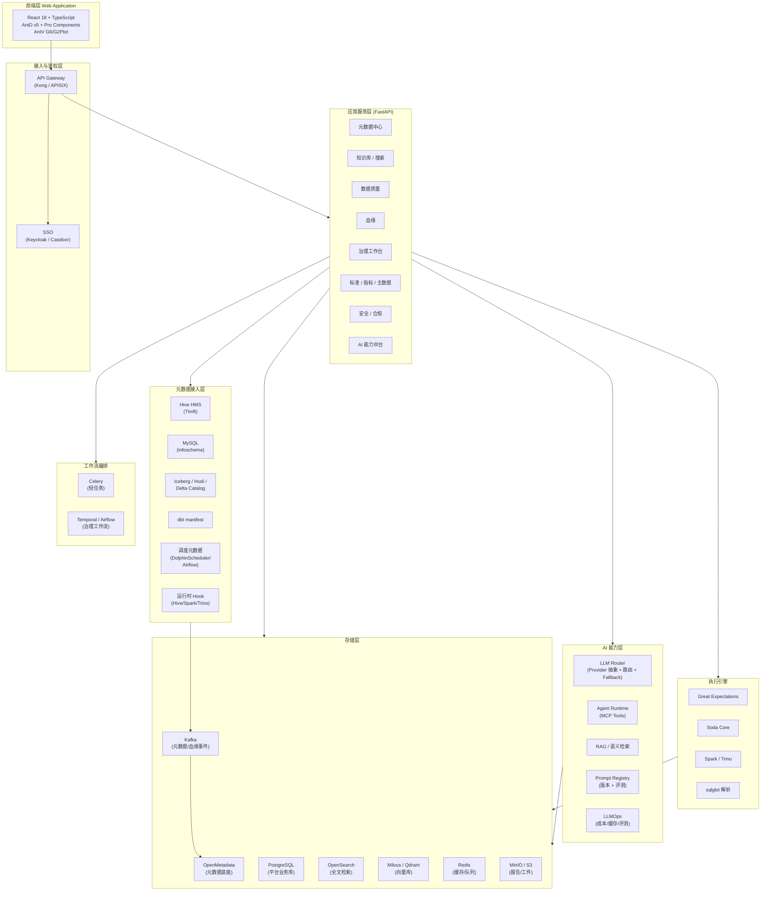
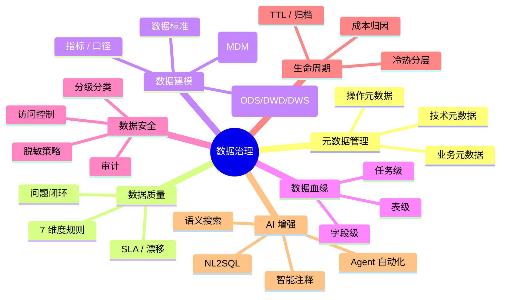

# AI 数据治理平台 · 总体规划（v2）

**版本**：v2.0  
**日期**：2026-04-28  
**状态**：架构修订稿  
**适用对象**：架构师 / 技术负责人 / 数据团队 / 安全合规

---

## 目录

1. [项目背景与目标](#一项目背景与目标)
2. [v2 设计原则](#二v2-设计原则)
3. [整体架构](#三整体架构)
4. [核心治理域](#四核心治理域)
5. [核心模块全景](#五核心模块全景)
6. [技术栈选型](#六技术栈选型)
7. [文档导航](#七文档导航)

---

## 一、项目背景与目标

### 1.1 背景

企业数仓建设进入"后半场"——表多、口径乱、血缘断、口径漂移、合规压力大。市面已有的开源治理底座（OpenMetadata / DataHub / Atlas）解决了**资产盘点**问题，但在两个方向仍是空白：

1. **治理动作的智能化**：从"看板 + 工单"升级为"AI Agent 自动巡检 + 推荐 + 闭环"。
2. **治理与建模的一体化**：数据标准、指标口径、主数据等"管理类"治理域在开源底座中较弱。

本项目目标是构建一套 **AI Native 的通用数据治理平台**：以开源元数据底座为地基，叠加**差异化的 AI 能力层**和**完整的治理域**。

### 1.2 核心目标（v2 修订）

| 目标 | 描述 | v1 → v2 变化 |
|---|---|---|
| 元数据统一接入 | Hive、MySQL、Iceberg、dbt、调度系统 | 扩展湖仓 + 调度元数据 |
| 数据资产知识库 | 自动字典 / 业务语义 / 全文 + 向量检索 | 强化 RAG 与语义搜索 |
| 数据探查与质量 | DQ 7 维度、SLA、漂移检测 | 引入 Great Expectations 等成熟引擎 |
| 数据血缘 | 任务 / 表 / 字段三级 | 双轨制：静态 + 运行时 Hook，OpenLineage 协议 |
| **数据标准 / 指标管理** | 字段标准、码值、指标口径 | **v2 新增** |
| **数据生命周期 / 成本** | 冷热分层、TTL、资产 ROI | **v2 新增** |
| **AI 操作系统** | 工业级 NL2SQL、智能注释、Agent + MCP、LLMOps | **v2 全面升级** |
| **安全与合规** | 分级分类、脱敏、RBAC/ABAC、审计、合规导出 | **v2 全面补齐** |

### 1.3 v1 → v2 主要变更

| 维度 | v1 方案 | v2 方案 | 决策理由 |
|---|---|---|---|
| 元数据底座 | 完全自研 | **基于 OpenMetadata 二次开发** | 节省 4-6 个月，连接器 / Schema 模型 / 血缘事件总线已成熟 |
| 数据质量 | 自研规则引擎 | **Great Expectations + Soda Core 编排** | 规则丰富、社区活跃，平台层只做编排和元数据 |
| 血缘 | 仅 sqlglot 静态解析 | **静态 + 运行时 Hook 双轨**，统一 OpenLineage 协议 | 静态解析覆盖率上限 ~85%，必须 Hook 兜底 |
| 全文检索 | Elasticsearch 8 | **OpenSearch 2.x** | ES8 SSPL License 商业风险，OS 协议友好 |
| 向量库 | pgvector | **Milvus / Qdrant**（pgvector 为开发模式）| 生产规模 pgvector 性能不够 |
| 任务编排 | Celery 单一 | **Celery（轻任务）+ Temporal / Airflow（工作流）** | 治理流程是有依赖工作流，Celery 不擅长 |
| Hive 接入 | PyHive (HiveServer2) | **HMS Thrift 直连 / metastore_db 直读** | 吞吐高 1-2 个数量级，元数据获取标准做法 |
| AI 定位 | "几个 LLM 调用" | **AI Operating System**（NL2SQL / Agent / RAG / LLMOps） | 项目核心差异化 |
| AI 阶段 | Phase 4 才上 | **Phase 1 即上智能注释 / 语义搜索** | 最容易展示价值的功能前置 |
| 治理域 | 仅 4 大件 | **+ 标准 / 指标 / 主数据 / 生命周期** | 对齐 DAMA-DMBOK，避免治理"只看不管" |
| 安全合规 | 风险章节一笔带过 | **独立架构文档** | 国内合规刚需，必须前置 |
| 多租户 | 后期再考虑 | **第一行代码就带 `tenant_id`** | 后期改造代价极高 |

---

## 二、v2 设计原则

> 这些原则是后续每个架构决策的"宪法"，发生冲突时按顺序优先级裁决。

| # | 原则 | 含义 |
|---|---|---|
| 1 | **安全优先 (Security First)** | 任何对外 LLM 调用都必须经过敏感信息校验；生产数据样本严禁出网。 |
| 2 | **复用而非重造 (Reuse over Rebuild)** | 元数据、血缘、DQ 都有成熟开源方案，差异化精力投在 AI 层和治理域。 |
| 3 | **AI 原生 (AI Native)** | AI 不是一个"插件 Tab"，而是治理工作流的内嵌引擎（Agent / Copilot / 自动化）。 |
| 4 | **可观测可治理 (Observable & Governable)** | 平台自身的元数据、Prompt、LLM 调用、成本、质量都被治理。 |
| 5 | **多租户优先 (Multi-tenant from Day-1)** | 全部数据模型、API、缓存键带 `tenant_id`，行级隔离。 |
| 6 | **配置化优先 (Config-driven)** | 数据源、LLM Provider、规则、Prompt、脱敏策略全部配置化、版本化。 |
| 7 | **协议优于实现 (Protocol over Implementation)** | OpenLineage / OpenMetadata / MCP / OpenAI 兼容协议是首选；具体实现可替换。 |
| 8 | **渐进式落地 (Incremental Delivery)** | 每 4 周一个可演示版本；MVP（注释 + 搜索）3 个月内必须上线。 |

---

## 三、整体架构

### 3.1 分层架构图

### 3.2 关键架构决策（ADR 摘要）

| ADR | 决策 | 替代方案 | 原因 |
|---|---|---|---|
| ADR-001 | 元数据底座选 **OpenMetadata** | DataHub / Atlas / 自研 | License 友好（Apache 2.0），数据模型完整，连接器最多 |
| ADR-002 | 全文检索用 **OpenSearch 2.x** | Elasticsearch 8 | ES8 SSPL License 商业风险 |
| ADR-003 | 向量库生产用 **Milvus**，开发用 **pgvector** | 单一 pgvector / Chroma | pgvector 规模有限，Milvus 经过大规模验证 |
| ADR-004 | DQ 引擎不自研，**编排 GE + Soda** | 自研 SQL 规则引擎 | 社区规则丰富、文档化好 |
| ADR-005 | 血缘走 **OpenLineage 协议**，静态 + Hook 双轨 | 仅 sqlglot 静态 | 静态解析覆盖率上限约 80-85%，生产必须 Hook 兜底 |
| ADR-006 | 工作流引擎选 **Temporal**（备选 Airflow） | Celery / Prefect | 治理流程是长事务有状态工作流，Celery 不擅长 |
| ADR-007 | LLM 协议统一为 **OpenAI 兼容** | 各家 SDK 直接对接 | 任何模型加一层网关都能接入，可替换性强 |
| ADR-008 | Agent 能力走 **MCP 协议** 暴露 | 自研 Function Calling | 业界标准，可被 IDE/Copilot 复用 |
| ADR-009 | 多租户采用 **共享库 + 行级 `tenant_id`** | 一租户一库 / 一租户一 schema | 兼顾隔离与运维成本，配合 RLS 策略 |
| ADR-010 | 鉴权外置到 **Keycloak / Casdoor** | 自研用户体系 | SSO + OAuth2 / OIDC 标准，避免重复造 |

> 完整 ADR 文档随实现迭代维护在 `doc/Architecture/adr/` 下（v2 立项后建立）。

---

## 四、核心治理域

按 DAMA-DMBOK 分类，平台覆盖以下治理域：

> 各治理域的详细设计见 [`01-元数据接入与建模.md`](./01-元数据接入与建模.md)、[`02-数据质量与血缘.md`](./02-数据质量与血缘.md)、[`04-安全与合规.md`](./04-安全与合规.md)。

---

## 五、核心模块全景

| 模块 | 核心能力 | 优先级 | 主要依赖 |
|------|---------|------|---------|
| **元数据中心 (Metadata Hub)** | 多源接入、Schema 同步、版本对比、资产目录 | P0 | OpenMetadata、Connector |
| **知识库与搜索 (Catalog & Search)** | 数据字典、术语表、全文 + 语义搜索、智能注释 | P0 | OpenSearch、Milvus、LLM |
| **数据探查 (Profiling)** | 基础统计、分布、异常、采样 | P0 | Spark / Trino / GE |
| **数据质量 (Data Quality)** | 7 维度规则、SLA 监控、漂移检测、工单闭环 | P0 | GE、Soda、Temporal |
| **数据血缘 (Lineage)** | 任务/表/字段级血缘、影响分析 | P1 | sqlglot、Hive/Spark Hook、OpenLineage |
| **数据标准 (Standards)** | 字段标准、码值表、命名规范、合规校验 | P1 | 自研 + AI 校验 |
| **指标管理 (Metric Store)** | 指标定义、口径、版本、一致性校验 | P1 | dbt-metrics / 自研轻量层 |
| **主数据 (MDM)** | 黄金记录、同义词归并、实体注册 | P2 | 自研 + AI |
| **生命周期与成本 (Lifecycle)** | 冷热分层、TTL、资产 ROI 评级 | P2 | 调度元数据 + 存储 API |
| **数据安全 (Security)** | 分级分类、脱敏、RBAC/ABAC、审计 | P0 | Keycloak、Ranger（可选）|
| **AI 能力中台 (AI Hub)** | LLM 路由、Prompt 治理、Agent、RAG、LLMOps | P0 | LLM、Milvus、Langfuse |
| **报告中心 (Report)** | 治理日报、合规导出、数据健康报告 | P2 | 模板引擎 + Agent |

---

## 六、技术栈选型

### 6.1 核心技术栈汇总

| 类别 | 选型 | 备选 / 备注 |
|------|------|-----------|
| **后端语言** | Python 3.11+ | Java 仅用于 OpenMetadata 服务侧 |
| **Web 框架** | FastAPI（async） | - |
| **ORM** | SQLAlchemy 2.x（async） | Tortoise ORM（备选）|
| **数据验证** | Pydantic v2 | - |
| **任务队列** | Celery + Redis | 轻任务、消息异步 |
| **工作流引擎** | Temporal | Airflow（如团队已有）|
| **API 网关** | Kong / APISIX | Traefik 轻量备选 |
| **SSO** | Keycloak | Casdoor（更轻）|
| **配置中心** | Nacos / Apollo | 纯 K8s 环境用 ConfigMap + Secret |
| **前端框架** | React 18 + TS + Vite | - |
| **UI 组件** | Ant Design v5 + Pro Components | - |
| **图表 / 图可视化** | G2Plot（统计）+ AntV G6（血缘） | ECharts（备选）|
| **状态管理** | Zustand + React Query | Redux Toolkit（备选）|
| **元数据底座** | **OpenMetadata** | DataHub / 自研 |
| **业务数据库** | PostgreSQL 15 | - |
| **缓存** | Redis 7 | - |
| **全文检索** | **OpenSearch 2.x** | Elasticsearch（License 风险）|
| **向量库** | **Milvus**（生产）/ pgvector（开发） | Qdrant / Weaviate |
| **对象存储** | MinIO（S3 兼容） | - |
| **消息总线** | Kafka | RedPanda（轻量备选）|
| **元数据采集 - Hive** | HMS Thrift Client / metastore_db 直读 | PyHive 仅作 fallback |
| **元数据采集 - MySQL** | SQLAlchemy + information_schema | - |
| **元数据采集 - 湖仓** | Iceberg/Hudi/Delta REST Catalog | - |
| **元数据采集 - dbt** | dbt manifest.json 解析 | - |
| **元数据采集 - 调度** | DolphinScheduler API / Airflow REST | - |
| **SQL 解析** | sqlglot | - |
| **血缘协议** | OpenLineage（Marquez 兼容）| - |
| **质量引擎** | Great Expectations + Soda Core | Apache Griffin / Deequ（Spark 场景） |
| **AI Provider** | OpenAI 兼容协议 + 多 Provider 路由 | Anthropic / 通义 / Ollama / vLLM |
| **AI 框架** | 自研抽象层（薄）+ LangChain（按需） | LlamaIndex（RAG 场景）|
| **Prompt 管理** | Langfuse | PromptLayer / 自研 |
| **LLM 评测** | LLM-as-a-Judge + 自研评测集 | RAGAS（RAG 评测） |
| **Agent 协议** | MCP（Model Context Protocol） | OpenAI Function Calling |
| **容器化** | Docker + Kubernetes + Helm | - |
| **监控** | Prometheus + Grafana | - |
| **日志** | Loki / Vector | ELK 备选 |
| **链路追踪** | OpenTelemetry + Jaeger / Tempo | - |
| **告警** | Alertmanager + 钉钉/企微 Webhook | PagerDuty |
| **CI/CD** | GitHub Actions / GitLab CI | - |

### 6.2 技术栈"红线"

- **License**：禁止 SSPL / BSL / 商业 License（Elasticsearch 8 / MongoDB / Redis Stack 部分模块）。
- **数据出网**：默认所有 LLM 调用走私有部署；若需调外网模型，必须经过敏感信息扫描网关。
- **依赖锁定**：每个环境用 `poetry.lock` / `pnpm-lock.yaml` 锁定，CI 校验。

---

## 七、文档导航

| 关注点 | 进入文档 |
|---|---|
| 元数据模型、连接器、湖仓 / dbt / 调度接入 | → [`01-元数据接入与建模.md`](./01-元数据接入与建模.md) |
| DQ 七维度、规则引擎、SLA、漂移、血缘双轨制 | → [`02-数据质量与血缘.md`](./02-数据质量与血缘.md) |
| LLM 抽象、NL2SQL 工业化、RAG、Agent、LLMOps | → [`03-AI能力层设计.md`](./03-AI能力层设计.md) |
| 数据分级分类、脱敏、RBAC/ABAC、合规 | → [`04-安全与合规.md`](./04-安全与合规.md) |
| K8s/Helm、多租户、监控告警、配置中心 | → [`05-部署与运维.md`](./05-部署与运维.md) |
| Phase 1-5 计划、风险清单 | → [`06-开发路线图与风险.md`](./06-开发路线图与风险.md) |

---

> 本文档为 v2 修订稿，**所有架构决策均可在 ADR 中追溯**。任何后续重大变更须通过 ADR 评审后回写本文档。
