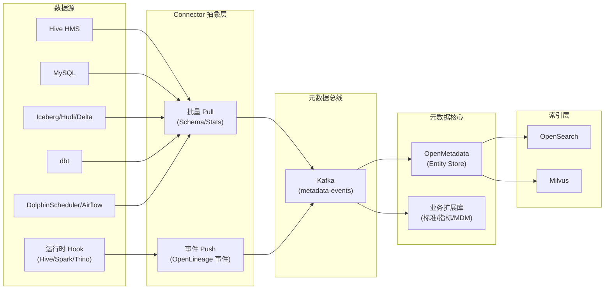
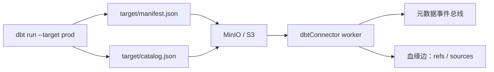

# 01 · 元数据接入与建模

**适用对象**：后端 / 数据工程 / 架构  
**前置阅读**：[`00-总体规划-v2.md`](./00-总体规划-v2.md)

---

## 目录

1. [治理域全景](#一治理域全景)
2. [统一元数据模型](#二统一元数据模型)
3. [Connector 抽象层](#三connector-抽象层)
4. [Hive 元数据接入](#四hive-元数据接入)
5. [MySQL 元数据接入](#五mysql-元数据接入)
6. [湖仓元数据接入（Iceberg / Hudi / Delta）](#六湖仓元数据接入)
7. [dbt 元数据接入](#七dbt-元数据接入)
8. [调度元数据接入](#八调度元数据接入)
9. [Schema 同步策略](#九schema-同步策略)
10. [数据标准 / 指标 / 主数据](#十数据标准--指标--主数据)
11. [生命周期与成本](#十一生命周期与成本)

---

## 一、治理域全景

v2 完整覆盖六大元数据域：

| 域 | 内容 | 来源 |
|---|---|---|
| **技术元数据** | 库 / 表 / 字段 / 分区 / 索引 / Schema 版本 | Hive HMS、MySQL info_schema、湖仓 Catalog |
| **业务元数据** | 中文名、业务含义、业务术语、所有者、域 | 人工 + AI 注释 |
| **操作元数据** | 任务执行、SLA、产出时间、读写次数、热度 | 调度系统、查询引擎日志 |
| **质量元数据** | DQ 规则、检查结果、问题单、整改记录 | DQ 引擎 |
| **管理元数据** | 数据标准、指标定义、主数据、分级分类 | 平台沉淀 |
| **血缘元数据** | 任务 / 表 / 字段血缘 | sqlglot + 运行时 Hook |



---

## 二、统一元数据模型

直接复用 **OpenMetadata Entity 模型**作为底座，业务扩展走独立扩展库（PostgreSQL）+ 自定义 Custom Property。

### 2.1 核心实体

| 实体类型 | 说明 | 关键属性 |
|---|---|---|
| `DataSource` | 数据源（Hive/MySQL/...） | type、connection、auth |
| `Database` | 库 | name、owner、tags |
| `Table` | 表 | columns、partitions、layer（ODS/DWD/...）、theme（主题域）、SLA |
| `Column` | 字段 | name、dataType、businessName、stdId、isPII、tags |
| `Pipeline` | 调度任务 | scheduler、cron、owner、SLA |
| `Lineage` | 血缘边 | from、to、columnMappings、source（static / runtime） |
| `Glossary` / `Term` | 业务术语 | term、definition、synonyms、relatedTerms |
| `Tag` / `Classification` | 标签体系 | category、policy（pii/sensitive/...）|
| `Metric` | 指标定义（v2 新增） | name、formula、dimensions、owner、version |
| `Standard` | 数据标准（v2 新增） | code、type（命名/码值/单位）、ruleSpec |
| `MasterEntity` | 主数据（v2 新增） | entityType、goldenRecordId、sourceMappings |

### 2.2 业务扩展（Custom Properties）

OpenMetadata 提供 Custom Property 机制，**v2 不在 OM 表里直接加列**，而是：

- 简单字段（如"业务域"、"机密级别"）→ Custom Property
- 复杂域（标准、指标、MDM）→ **PostgreSQL 扩展库**，通过 `entityFQN` 关联 OM 实体

```sql
-- 扩展库示例：标准与字段关联
CREATE TABLE std_field_binding (
    id            BIGSERIAL PRIMARY KEY,
    tenant_id     VARCHAR(64)  NOT NULL,
    entity_fqn    VARCHAR(512) NOT NULL,  -- e.g. hive.dwd_db.user_info.user_id
    standard_id   BIGINT       NOT NULL,
    bind_type     VARCHAR(32)  NOT NULL,  -- naming / codelist / unit / format
    confidence    NUMERIC(4,3),           -- AI 推荐时的置信度
    created_by    VARCHAR(64),
    created_at    TIMESTAMP    DEFAULT now(),
    UNIQUE (tenant_id, entity_fqn, standard_id, bind_type)
);
CREATE INDEX idx_std_binding_entity ON std_field_binding(tenant_id, entity_fqn);
```

> **多租户红线**：所有扩展表第一列必须是 `tenant_id`，配合 PostgreSQL Row-Level Security (RLS) 强制隔离。

---

## 三、Connector 抽象层

### 3.1 接口契约

```python
# backend/connectors/base.py
from abc import ABC, abstractmethod
from typing import Iterable
from pydantic import BaseModel

class ConnectionTestResult(BaseModel):
    ok: bool
    latency_ms: int | None = None
    error: str | None = None
    server_version: str | None = None

class MetadataConnector(ABC):
    """所有数据源 Connector 的统一接口。"""

    type: str  # hive / mysql / iceberg / dbt / dolphinscheduler ...

    @abstractmethod
    def test_connection(self) -> ConnectionTestResult: ...

    @abstractmethod
    def list_databases(self) -> Iterable[str]: ...

    @abstractmethod
    def list_tables(self, database: str) -> Iterable[str]: ...

    @abstractmethod
    def get_table(self, database: str, table: str) -> "TableMeta": ...

    @abstractmethod
    def get_columns(self, database: str, table: str) -> Iterable["ColumnMeta"]: ...

    @abstractmethod
    def get_partitions(self, database: str, table: str, limit: int = 100) -> Iterable["PartitionMeta"]: ...

    @abstractmethod
    def get_table_stats(self, database: str, table: str) -> "TableStats": ...

    def get_sample(self, database: str, table: str, limit: int = 100) -> Iterable[dict]:
        """可选实现，默认抛 NotImplementedError；样本读取走单独的鉴权审批流。"""
        raise NotImplementedError
```

### 3.2 注册与发现

```python
# backend/connectors/registry.py
class ConnectorRegistry:
    _registry: dict[str, type[MetadataConnector]] = {}

    @classmethod
    def register(cls, conn_type: str):
        def deco(klass): cls._registry[conn_type] = klass; return klass
        return deco

    @classmethod
    def create(cls, conn_type: str, config: dict) -> MetadataConnector:
        if conn_type not in cls._registry:
            raise ValueError(f"Unknown connector type: {conn_type}")
        return cls._registry[conn_type](**config)
```

每个 Connector 实现以 `@ConnectorRegistry.register("hive")` 形式自注册。新增数据源仅需新增一个文件，不动核心代码。

### 3.3 标准化 DTO

```python
class ColumnMeta(BaseModel):
    name: str
    data_type: str
    nullable: bool = True
    primary_key: bool = False
    comment: str | None = None
    default_value: str | None = None
    ordinal_position: int
```

`TableMeta`、`PartitionMeta`、`TableStats` 类似。所有 Connector 输出**统一 DTO**，避免上层模块识别多种格式。

---

## 四、Hive 元数据接入

### 4.1 接入方式对比

| 方式 | 性能 | 元数据完整度 | 推荐度 |
|---|---|---|---|
| **HMS Thrift Client（推荐）** | ⭐⭐⭐⭐⭐ | ⭐⭐⭐⭐⭐ | 主路径 |
| 直读 metastore_db (MySQL/PG) | ⭐⭐⭐⭐⭐ | ⭐⭐⭐⭐⭐ | 备选（仅同 IDC + 只读账号）|
| HiveServer2 + `DESCRIBE` (PyHive) | ⭐⭐ | ⭐⭐⭐ | 仅作 fallback |
| HiveServer2 + JDBC | ⭐⭐ | ⭐⭐⭐ | 不推荐 |

> v1 用 PyHive 是错误选型——它走 HiveServer2，对每张表都要起一个 SQL 任务，几千张表同步要数小时。

### 4.2 HMS Thrift Client 实现

```python
# backend/connectors/hive_connector.py
from hive_metastore import ThriftHiveMetastore  # gen-py 自动生成
from thrift.transport import TSocket, TTransport
from thrift.protocol import TBinaryProtocol

@ConnectorRegistry.register("hive")
class HiveConnector(MetadataConnector):
    type = "hive"

    def __init__(self, host: str, port: int = 9083, auth: str = "NONE",
                 kerberos_principal: str | None = None, **_):
        self.host, self.port, self.auth = host, port, auth
        self._principal = kerberos_principal
        self._client = self._build_client()

    def _build_client(self):
        sock = TSocket.TSocket(self.host, self.port)
        if self.auth == "KERBEROS":
            from thrift_sasl import TSaslClientTransport
            transport = TSaslClientTransport(
                lambda: _kerberos_factory(self._principal), "GSSAPI", sock
            )
        else:
            transport = TTransport.TBufferedTransport(sock)
        protocol = TBinaryProtocol.TBinaryProtocol(transport)
        client = ThriftHiveMetastore.Client(protocol)
        transport.open()
        return client

    def list_databases(self):
        return self._client.get_all_databases()

    def list_tables(self, database):
        return self._client.get_all_tables(database)

    def get_table(self, database, table):
        t = self._client.get_table(database, table)
        return TableMeta(
            database=database,
            name=table,
            location=t.sd.location,
            input_format=t.sd.inputFormat,
            owner=t.owner,
            create_time=t.createTime,
            partition_keys=[c.name for c in t.partitionKeys],
            properties=dict(t.parameters or {}),
        )
    # ... get_columns / get_partitions / get_table_stats 同理
```

### 4.3 配置示例

```yaml
datasources:
  - name: prod-hive
    type: hive
    enabled: true
    connection:
      host: hive-metastore.company.com
      port: 9083
      auth: KERBEROS
      kerberos_principal: hive/host@REALM
      keytab: /etc/security/keytabs/hive.keytab
    sync:
      schedule: "0 2 * * *"
      include_databases: ["ods_*", "dwd_*", "dws_*", "ads_*"]
      exclude_tables: ["tmp_*", "test_*", "*_bak"]
      incremental: true        # 基于 last_modified 增量同步
      partition_sample: 100    # 大表分区只取最近 100 个
```

### 4.4 Kerberos 开发体验

**问题**：开发同学在 macOS / Windows 上配 Kerberos 几乎是地狱。

**解决**：

1. 远程 Devbox（Linux + KDC 已配好）+ VS Code Remote SSH
2. 平台开发模式提供 **Mock Connector**，返回预设的 metastore dump
3. 联调环境（共享 Hive）只用受控测试账号

---

## 五、MySQL 元数据接入

```python
# backend/connectors/mysql_connector.py
@ConnectorRegistry.register("mysql")
class MySQLConnector(MetadataConnector):
    type = "mysql"

    def __init__(self, host, port, user, password, ssl=False, **_):
        url = f"mysql+pymysql://{user}:{password}@{host}:{port}"
        self.engine = create_engine(url, pool_pre_ping=True,
                                    connect_args={"ssl": {} if ssl else None})

    def list_databases(self):
        with self.engine.connect() as c:
            rows = c.execute(text(
                "SELECT SCHEMA_NAME FROM information_schema.SCHEMATA "
                "WHERE SCHEMA_NAME NOT IN "
                "('mysql','sys','performance_schema','information_schema')"
            ))
            return [r[0] for r in rows]

    def get_columns(self, database, table):
        with self.engine.connect() as c:
            rows = c.execute(text("""
                SELECT COLUMN_NAME, COLUMN_TYPE, IS_NULLABLE,
                       COLUMN_KEY, COLUMN_DEFAULT, COLUMN_COMMENT, ORDINAL_POSITION
                FROM information_schema.COLUMNS
                WHERE TABLE_SCHEMA = :db AND TABLE_NAME = :tbl
                ORDER BY ORDINAL_POSITION
            """), {"db": database, "tbl": table})
            return [ColumnMeta(
                name=r[0], data_type=r[1], nullable=(r[2]=="YES"),
                primary_key=(r[3]=="PRI"), default_value=r[4],
                comment=r[5], ordinal_position=r[6],
            ) for r in rows]
```

**关键点**：

1. 自动读取 `COLUMN_COMMENT` 填充业务名（v1 已设计）。
2. 通过 `pool_pre_ping=True` 防止僵尸连接。
3. 账号最小权限：仅 `information_schema` + 业务库 `SELECT`。
4. CDC 元数据变更（DDL）可通过 Debezium → Kafka → 平台事件总线（生产环境推荐）。

---

## 六、湖仓元数据接入

v1 完全没覆盖，v2 必须支持。

### 6.1 Iceberg

| 接入方式 | 说明 |
|---|---|
| **REST Catalog** | Iceberg 1.4+ 推荐，HTTP 接口标准 |
| Hive Catalog | 走 HMS（Iceberg 表注册到 HMS）|
| Glue Catalog | AWS 生态 |
| Nessie | 含版本控制 |

```python
@ConnectorRegistry.register("iceberg")
class IcebergConnector(MetadataConnector):
    def __init__(self, catalog_type: str, uri: str, **kwargs):
        from pyiceberg.catalog import load_catalog
        self.catalog = load_catalog(name="prod", **{
            "type": catalog_type, "uri": uri, **kwargs
        })

    def list_databases(self):
        return [ns[0] for ns in self.catalog.list_namespaces()]

    def get_table(self, database, table):
        t = self.catalog.load_table(f"{database}.{table}")
        return TableMeta(
            database=database, name=table,
            location=t.location(),
            partition_keys=[f.name for f in t.spec().fields],
            properties=dict(t.properties or {}),
            extra={
                "format_version": t.format_version,
                "current_snapshot_id": t.current_snapshot().snapshot_id if t.current_snapshot() else None,
            }
        )
```

**Iceberg 特有元数据**（v2 必须暴露）：

- Schema 演进历史（`schemas` 列表）
- Snapshot 历史（时间旅行）
- 分区演进（`partition-spec` 多版本）
- Manifest 文件大小（成本相关）

### 6.2 Hudi / Delta Lake

- **Hudi**：通过 HMS（Hudi 同步 metadata 到 Hive） + `hudi-cli` REST 接口
- **Delta Lake**：通过 Unity Catalog（Databricks）/ deltalake Python 库读取 `_delta_log/`

---

## 七、dbt 元数据接入

dbt 是数仓 SQL 转换的事实标准，**`manifest.json` 是天然的金矿**：

| dbt 工件 | 价值 |
|---|---|
| `manifest.json` | 模型、SQL、依赖、测试、字段描述 |
| `catalog.json` | 表实际 Schema、行数、字节数 |
| `run_results.json` | 上次运行结果、SLA |
| `sources.yml` | 数据源声明（绑定到平台 DataSource） |

### 7.1 接入流程



### 7.2 关键转换

```python
# backend/connectors/dbt_connector.py
class DbtConnector(MetadataConnector):
    def __init__(self, manifest_path: str, catalog_path: str | None = None, **_):
        self.manifest = json.load(open(manifest_path))
        self.catalog = json.load(open(catalog_path)) if catalog_path else None

    def emit_lineage_events(self) -> Iterable[OpenLineageEvent]:
        for node_id, node in self.manifest["nodes"].items():
            if node["resource_type"] != "model":
                continue
            outputs = [self._to_dataset(node)]
            inputs = [self._to_dataset(self.manifest["nodes"][p])
                      for p in node["depends_on"]["nodes"]
                      if p in self.manifest["nodes"]]
            yield OpenLineageEvent(
                eventType="COMPLETE",
                job={"namespace": "dbt", "name": node["unique_id"]},
                inputs=inputs, outputs=outputs,
                facets={"sql": {"query": node["compiled_code"]}},
            )
```

dbt 的 `descriptions` 字段直接同步成业务元数据，**省掉一大半的字典编写工作**。

---

## 八、调度元数据接入

### 8.1 价值

> 没有调度元数据，平台只能看见"表"，看不见"任务和 SLA"——治理就缺了一条腿。

| 调度系统 | 接入方式 |
|---|---|
| **DolphinScheduler** | OpenAPI（projects / process-instance）+ `t_ds_task_instance` 直读（高频）|
| **Airflow** | REST API + `dag_run` / `task_instance` 表 + OpenLineage Provider |
| **DataWorks** | OpenAPI（阿里云 SDK）|
| **Azkaban / Oozie** | 仅作降级支持 |

### 8.2 关键采集字段

| 字段 | 用途 |
|---|---|
| 任务 ID / DAG ID | 任务元数据主键 |
| Owner | 与表 Owner 联动 |
| 调度表达式 | SLA 计算 |
| 上次/下次运行时间 | 时效性监控 |
| SQL / 脚本 | 静态血缘解析输入 |
| 输入 / 输出表（如有声明） | 血缘补充 |

### 8.3 与血缘的协作

调度元数据 + 运行时 Hook 双向校验：

- 调度声明：A 任务 → 写表 X
- Hook 实际：A 任务的 Spark Session 写了表 X、Y
- **差异告警**：Y 是"未声明的副作用"，治理工单提示 Owner 修正声明

详见 [`02-数据质量与血缘.md`](./02-数据质量与血缘.md#四数据血缘双轨制)。

---

## 九、Schema 同步策略

### 9.1 三种同步模式

| 模式 | 触发 | 适用 | 实现 |
|---|---|---|---|
| **全量同步** | 手动 / 首次接入 | 新数据源、灾后重建 | 遍历所有库表 |
| **增量同步** | 定时 Cron（每日 / 每小时）| 日常 | 基于 `last_modified` 或 LIST 差异 |
| **事件同步** | 实时 | 关键数据源 | DDL CDC（Debezium）/ HMS Notification Log |

### 9.2 增量同步实现要点

```python
# 伪代码：基于 HMS NotificationLog
def incremental_sync_hive(connector, last_event_id: int):
    events = connector.get_next_notifications(last_event_id, batch=1000)
    for ev in events:
        if ev.eventType == "CREATE_TABLE":
            handle_create_table(ev)
        elif ev.eventType == "ALTER_TABLE":
            handle_alter_table(ev)
        elif ev.eventType == "DROP_TABLE":
            handle_drop_table(ev)
        elif ev.eventType == "ADD_PARTITION":
            handle_add_partition(ev)
    save_checkpoint(events[-1].eventId)
```

### 9.3 限流与对源压力保护

| 措施 | 说明 |
|---|---|
| 错峰 | 不同数据源错开同步窗口 |
| 限流 | 每数据源 QPS 限制（默认 50） |
| 增量 | 默认增量，全量需手动触发 |
| 隔离账号 | 同步走只读账号，独立连接池 |
| 超时熔断 | 单表同步超 30s 标记降级 |

### 9.4 Schema 版本化

每次同步对比上一版本，生成**变更事件**：

```json
{
  "tenant_id": "default",
  "entity_fqn": "hive.dwd_db.user_info",
  "changes": [
    {"op": "ADD_COLUMN", "column": "phone_md5", "data_type": "STRING"},
    {"op": "ALTER_COLUMN", "column": "age", "old": "INT", "new": "BIGINT"},
    {"op": "DROP_COLUMN", "column": "deprecated_field"}
  ],
  "detected_at": "2026-04-28T02:01:00Z"
}
```

下游消费方：

- AI 注释模块：触发新增字段的注释生成
- 影响分析：DROP / ALTER 列触发血缘下游告警
- 工单：未通知 Owner 的破坏性变更自动开单

---

## 十、数据标准 / 指标 / 主数据

v2 新增的"管理类"治理域。

### 10.1 数据标准 (Data Standards)

| 标准类型 | 示例 |
|---|---|
| **命名标准** | 字段必须 `snake_case`、ODS 表前缀 `ods_`、日期字段必须以 `_dt` 结尾 |
| **码值标准** | 性别 (M/F/U)、订单状态 (paid/refunded/canceled) |
| **格式标准** | 手机号、身份证、邮箱正则 |
| **单位标准** | 金额单位（分 / 元）、时间单位、计量单位 |

**实现**：

- 标准库：`std_definitions` 表
- 字段绑定：`std_field_binding`（见 § 2.2）
- 校验引擎：每次 Schema 同步后自动跑标准校验，违规列表入治理工单
- AI 推荐：相似字段名/类型自动推荐绑定哪个标准（带置信度）

### 10.2 指标管理 (Metric Store)

> "口径不一致"是数据团队 50% 时间消耗的来源。

#### 选型：

| 方案 | 推荐度 |
|---|---|
| **dbt-metrics + MetricFlow** | ⭐⭐⭐⭐ 已用 dbt 团队首选 |
| **Cube.dev** | ⭐⭐⭐ 独立指标层 |
| **自研轻量层（YAML 定义 + SQL 模板）** | ⭐⭐⭐⭐ 可控 |

v2 默认走**自研轻量层**（与 dbt-metrics 数据模型对齐，方便后续迁移）：

```yaml
# metrics/order_revenue.yml
metric:
  name: gmv_daily
  display_name: "日成交金额（元）"
  owner: trade-team
  domain: 交易
  type: simple
  measure:
    expr: "sum(amount)"
    table: dwd_order_detail
    filter: "is_valid = 1"
  dimensions:
    - dt
    - city_id
    - shop_id
  unit: CNY
  precision: 2
  versioning: true
  status: active
```

平台能力：

- **指标登记** + **版本** + **审批**
- **口径检查**：检测两个指标是否定义"同名不同义"或"同义不同名"
- **指标到字段的血缘**：被哪些报表 / 看板使用
- **NL2SQL 优先命中指标层**：自然语言问答优先返回指标，避免直接命中明细表（详见 [`03-AI能力层设计.md`](./03-AI能力层设计.md)）

### 10.3 主数据 (MDM)

精简版 MDM，聚焦"识别 + 归并"，不做完整 MDM 引擎：

- **实体注册**：客户、商品、组织、商家
- **黄金记录 ID**：每个实体的统一 ID
- **同义词归并**：基于规则 + 向量相似度，AI 推荐归并
- **源系统映射表**：黄金 ID ↔ 各源系统 ID

---

## 十一、生命周期与成本

### 11.1 数据生命周期

| 阶段 | 触发条件 | 操作 |
|---|---|---|
| 热 | 近 30 天有读写 | 默认存储 |
| 温 | 30-180 天 | 提示降存储等级 |
| 冷 | 180+ 天且低读 | 提示归档 |
| 归档 | 1 年+ 且无读 | 移动到冷存储 / 删除待审批 |

### 11.2 成本归因

数据来源：

- 存储：HDFS / 对象存储 API
- 计算：调度系统任务执行日志（CPU 时长、Memory）
- 查询：Trino / Spark History

输出：

- 表级成本仪表盘
- 主题域 / Owner / 业务域成本分摊
- **资产 ROI 评级**：成本 vs. 被引用次数 / 被查询次数 / 关联报表数

ROI 极低的资产 → 自动列入"治理候选"。

---

> 下一篇：[`02-数据质量与血缘.md`](./02-数据质量与血缘.md)
