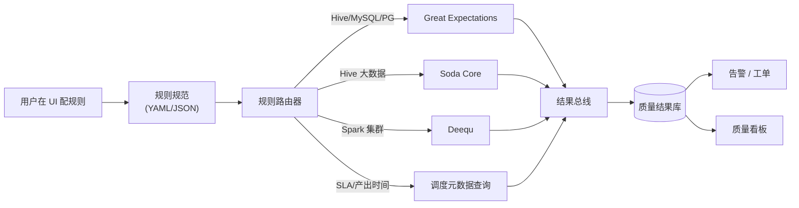
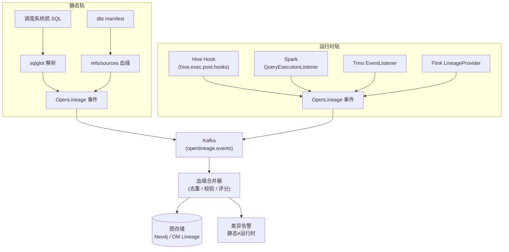
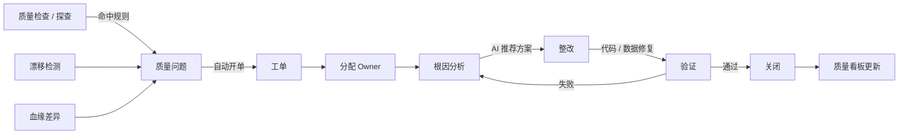

# 02 · 数据质量与血缘

**适用对象**：后端 / 数据工程 / 数据产品  
**前置阅读**：[`00-总体规划-v2.md`](./00-总体规划-v2.md)

---

## 目录

1. [设计原则](#一设计原则)
2. [数据探查 (Profiling)](#二数据探查)
3. [数据质量七维度](#三数据质量七维度)
4. [数据血缘双轨制](#四数据血缘双轨制)
5. [质量工作流闭环](#五质量工作流闭环)

---

## 一、设计原则

| # | 原则 |
|---|---|
| 1 | **不重造规则引擎**：编排 Great Expectations / Soda Core，平台只做调度、记录、可视化、闭环 |
| 2 | **DQ 标准化为 7 维度**：完整性 / 唯一性 / 有效性 / 准确性 / 一致性 / 及时性 / 可访问性 |
| 3 | **血缘双轨制**：静态解析（sqlglot）+ 运行时 Hook，统一为 OpenLineage 协议 |
| 4 | **采样优先**：大表探查默认分层采样，不允许全表扫描 |
| 5 | **闭环优先**：每个质量问题必须有 Owner、SLA、整改路径 |

---

## 二、数据探查 (Profiling)

### 2.1 探查指标矩阵

| 指标类 | 数值字段 | 字符串字段 | 时间字段 | 布尔 |
|---|---|---|---|---|
| 行数 / 空值率 | ✅ | ✅ | ✅ | ✅ |
| 唯一值数 / 唯一率 | ✅ | ✅ | ✅ | ✅ |
| Min / Max / Avg / Stddev | ✅ | - | ✅ | - |
| 长度分布（min/max/avg） | - | ✅ | - | - |
| Top-N 频次 | ✅ | ✅ | ✅ | ✅ |
| 直方图（10 桶） | ✅ | - | ✅ | - |
| 格式合法率（正则） | - | ✅ | ✅ | - |
| 数据漂移（PSI / KS） | ✅ | ✅ | ✅ | ✅ |
| 字段相关性 | ✅ | - | - | - |

### 2.2 采样策略（必须）

> v1 写"默认 10 万行"，但 10 万行在数十亿行表里无代表性。v2 采用**分层采样 + 分区感知**。

| 表规模 | 采样方式 |
|---|---|
| < 100 万行 | 全量 |
| 100 万 - 1 亿 | 随机采样 100 万行 |
| > 1 亿 | **按分区分层采样**：每个最近分区采样 10 万行 + 历史分区抽样 |
| 时间分区表 | 优先最近 N 个分区，老分区抽样 |

```python
# 探查任务采样配置
class ProfilingSampling(BaseModel):
    strategy: Literal["full", "random", "stratified_partition"]
    sample_rows: int = 1_000_000
    recent_partitions: int = 7
    history_partition_ratio: float = 0.05
    seed: int = 42
```

### 2.3 执行引擎选择

| 数据源 | 推荐引擎 | 原因 |
|---|---|---|
| Hive 大表 | **Spark + Deequ** | 分布式分析、内置 Profile 算法 |
| Hive 中小表 | Trino + GE | 启动快，SQL 友好 |
| MySQL | SQLAlchemy + GE | 数据量小直接 SQL |
| Iceberg | Spark + Iceberg connector | 原生支持 |
| 实时流 | Flink Profile（Phase 4 再考虑） | - |

### 2.4 PII 检测

探查阶段同步识别敏感字段，输入下游脱敏决策：

- **规则**：字段名 / 注释关键词（手机号、身份证、邮箱、姓名…）
- **正则**：样本值匹配（采样后即销毁原始值，只留命中率）
- **AI 模型**：调用 LLM 对字段名 + 业务上下文判断
- **置信度合并**：三路加权，> 0.8 自动打标 PII，0.5-0.8 进入人工审核

详见 [`04-安全与合规.md § 二、数据分级分类`](./04-安全与合规.md#二数据分级分类)。

---

## 三、数据质量七维度

### 3.1 七维度定义与样例规则

| 维度 | 定义 | 规则示例 |
|---|---|---|
| **完整性 (Completeness)** | 字段非空、记录数符合预期 | `null_rate(user_id) = 0`、`row_count(today) >= 0.9 * row_count(yesterday)` |
| **唯一性 (Uniqueness)** | 主键/业务键不重复 | `unique(order_id)`、`unique(user_id, dt)` |
| **有效性 (Validity)** | 符合格式 / 枚举 / 范围 | `phone matches ^1[3-9]\d{9}$`、`status in ('paid','refunded','canceled')` |
| **准确性 (Accuracy)** | 与权威源/计算逻辑一致 | `sum(amount) = sum(items.qty * items.price)` |
| **一致性 (Consistency)** | 跨表 / 跨系统一致 | `dwd_order.user_id ⊆ dim_user.user_id` |
| **及时性 (Timeliness)** | 按 SLA 产出、近实时 | `partition(dt=today) ready before 03:00`、`max(update_time) within 5min` |
| **可访问性 (Accessibility)** | 可被授权用户读取 | `select count(*) returns within 30s`、`授权用户列表 ≠ 空` |

### 3.2 引擎选型与编排



### 3.3 规则配置示例

```yaml
# rules/dwd_order_dq.yml
ruleset:
  name: dwd_order_quality
  target:
    datasource: prod-hive
    table: dwd_db.dwd_order
  schedule:
    cron: "30 3 * * *"        # 每天产出后 30 分钟跑
    sla_dependency:
      task: dwd_order_etl       # 依赖此任务完成
      max_wait: 30m
  rules:
    - id: dq-001
      dim: completeness
      desc: "订单 ID 不能为空"
      engine: ge
      expectation: expect_column_values_to_not_be_null
      column: order_id
      threshold: 0
      severity: P0

    - id: dq-002
      dim: uniqueness
      desc: "订单 ID 唯一"
      engine: ge
      expectation: expect_column_values_to_be_unique
      column: order_id
      severity: P0

    - id: dq-003
      dim: validity
      desc: "金额范围合理"
      engine: ge
      expectation: expect_column_values_to_be_between
      column: amount
      min_value: 0
      max_value: 1000000
      severity: P1

    - id: dq-004
      dim: accuracy
      desc: "总金额 = 明细之和"
      engine: soda
      sql: |
        SELECT
          (SELECT SUM(amount) FROM dwd_db.dwd_order WHERE dt='${dt}') -
          (SELECT SUM(qty * price) FROM dwd_db.dwd_order_item WHERE dt='${dt}') AS diff
        HAVING ABS(diff) > 0.01
      severity: P0

    - id: dq-005
      dim: timeliness
      desc: "T+1 03:00 前必须产出"
      engine: scheduler
      check: partition_ready
      partition: "dt=${yesterday}"
      deadline: "03:00"
      severity: P0

    - id: dq-006
      dim: consistency
      desc: "用户 ID 在 dim_user 内"
      engine: ge
      expectation: expect_column_values_to_be_in_set
      column: user_id
      reference_query: "SELECT user_id FROM dim_db.dim_user"
      severity: P1

    - id: dq-007
      dim: drift
      desc: "金额分布无显著漂移"
      engine: deequ
      check: psi
      column: amount
      baseline_partition: "dt=${yesterday-1}"
      threshold: 0.2
      severity: P2
```

### 3.4 时效性 / SLA 监控

> v1 完全没提，但生产事故 60% 都来自"今天数据没产出"。

实现：

- 数据源：调度元数据 + 表分区元数据 + Hive Metastore CHANGE Log
- 监控对象：
  - **任务 SLA**：调度任务在 deadline 前完成
  - **分区就绪**：表分区在 deadline 前可见且数据量正常
  - **下游延迟**：链路 A → B → C，A 延迟 30min，自动通知 B、C 的 Owner
- 告警分级：P0（影响生产报表）/ P1（影响内部分析）/ P2（提示）

### 3.5 数据漂移 (Drift Detection)

| 算法 | 适用 | 阈值（建议） |
|---|---|---|
| **PSI**（Population Stability Index） | 数值 / 离散分布 | < 0.1 稳定，0.1-0.2 微漂移，> 0.2 显著漂移 |
| **KS 检验** | 数值连续分布 | p-value < 0.05 显著 |
| **卡方检验** | 离散分布 | p-value < 0.05 显著 |
| **Schema Drift** | 字段增删改 | 任何变化都告警 |

实现：

- 每日探查时计算当日分布
- 与 baseline（昨日 / 上周同期 / 自定义）对比
- 漂移结果回写元数据：`column.drift_score = 0.34`
- AI 增强：LLM 解释漂移原因，生成可读报告（"金额分布右移，可能与 X 活动相关"）

---

## 四、数据血缘双轨制

### 4.1 为什么必须双轨

> sqlglot 静态解析在生产数据集上覆盖率上限通常在 **75% - 85%**，下列场景容易翻车：

- 动态 SQL（变量拼接、分支判断、`IF EXISTS` 后建表）
- `INSERT OVERWRITE ... SELECT * FROM ...` 通配
- UDF / UDTF 中间引用
- 临时表、CTE 嵌套较深
- 跨数据源 SQL（Hive 读 MySQL、Spark 读 Iceberg）
- DataX / Sqoop / Flink SQL 等非 ANSI 写法

**v2 强制双轨**：



### 4.2 OpenLineage 协议

统一事件格式：

```json
{
  "eventType": "COMPLETE",
  "eventTime": "2026-04-28T03:01:23Z",
  "run": {"runId": "uuid-...", "facets": {}},
  "job": {
    "namespace": "dolphinscheduler.prod",
    "name": "dwd.dwd_order_etl",
    "facets": {
      "sql": {"query": "INSERT OVERWRITE TABLE dwd_order ..."}
    }
  },
  "inputs": [
    {"namespace": "hive.prod", "name": "ods_db.ods_order"},
    {"namespace": "hive.prod", "name": "dim_db.dim_user"}
  ],
  "outputs": [
    {
      "namespace": "hive.prod",
      "name": "dwd_db.dwd_order",
      "facets": {
        "schema": {...},
        "columnLineage": {
          "fields": {
            "order_id": {"inputFields": [{"namespace":"hive.prod","name":"ods_db.ods_order","field":"id"}]}
          }
        }
      }
    }
  ]
}
```

### 4.3 三级血缘

| 级别 | 节点 | 边 | 用途 |
|---|---|---|---|
| **任务级** | 调度任务 | 任务 → 任务（基于触发依赖）| 故障传播分析 |
| **表级** | 库.表 | 表 → 表 | 影响分析 |
| **字段级** | 库.表.字段 | 字段 → 字段 | DSAR、敏感链路追踪 |

### 4.4 血缘合并与冲突

合并器逻辑：

```python
def merge_lineage(static_edges, runtime_edges):
    merged = {}
    # 运行时优先（更可信）
    for e in runtime_edges:
        merged[e.key] = {**e.dict(), "source": "runtime", "confidence": 1.0}
    for e in static_edges:
        if e.key not in merged:
            merged[e.key] = {**e.dict(), "source": "static", "confidence": 0.85}
    return merged

def detect_drift(static_edges, runtime_edges):
    static_set = {e.key for e in static_edges}
    runtime_set = {e.key for e in runtime_edges}
    return {
        "missing_in_static": runtime_set - static_set,    # 实际跑了但 SQL 里没声明
        "missing_in_runtime": static_set - runtime_set,   # 声明了但没跑（任务死了？）
    }
```

差异结果直接生成治理工单。

### 4.5 影响分析

UI 上选中一张表，点击"影响分析"：

1. 沿血缘下游 BFS（默认 3 层）
2. 标注每个节点：表 / 报表 / 看板 / API
3. 关联 Owner、SLA、最近读写时间
4. 一键群发通知（变更预告）

---

## 五、质量工作流闭环

### 5.1 闭环流程



### 5.2 工单数据模型

```sql
CREATE TABLE dq_issue (
    id            BIGSERIAL PRIMARY KEY,
    tenant_id     VARCHAR(64) NOT NULL,
    rule_id       VARCHAR(64) NOT NULL,
    entity_fqn    VARCHAR(512) NOT NULL,
    severity      VARCHAR(8)  NOT NULL,      -- P0/P1/P2
    status        VARCHAR(16) DEFAULT 'open',-- open/assigned/in_progress/closed
    detected_at   TIMESTAMP   DEFAULT now(),
    closed_at     TIMESTAMP,
    owner         VARCHAR(64),
    root_cause    TEXT,
    fix_plan      TEXT,
    fix_pr_url    VARCHAR(512),
    ai_summary    TEXT,                       -- LLM 生成的根因摘要
    detail        JSONB                       -- 命中样本、SQL、阈值等
);

CREATE INDEX idx_dq_issue_status ON dq_issue(tenant_id, status, severity);
CREATE INDEX idx_dq_issue_entity ON dq_issue(tenant_id, entity_fqn);
```

### 5.3 AI 在闭环中的角色

| 步骤 | AI 能力 |
|---|---|
| 规则推荐 | 基于字段名 / 类型 / 历史样本，自动推荐应用哪些规则 |
| 根因分析 | 读问题数据 + 上游血缘 + 最近变更，给出疑似原因 |
| 整改方案 | 生成 SQL 修复脚本草稿 / dbt 模型修改建议（人工审核后执行）|
| 工单摘要 | 把详情压缩为 200 字摘要，便于扫单 |
| SLA 风险预测 | 根据上游延迟传播，预测下游 SLA 是否会被打破 |

详见 [`03-AI能力层设计.md § 七、Agent 与 MCP`](./03-AI能力层设计.md#七agent-与-mcp)。

### 5.4 质量看板核心指标

| 指标 | 定义 |
|---|---|
| 健康分 | (1 - 加权命中率) × 100 |
| P0 在途 | 当前未关闭的 P0 工单数 |
| 平均关闭时长 | 按 P0/P1/P2 分组 |
| 漂移指数 | 近 7 天有漂移告警的字段占比 |
| SLA 达成率 | 任务级 / 表级 / 报表级 |
| Top 痛点表 | 命中规则最多的 Top-N 表 |

---

> 上一篇：[`01-元数据接入与建模.md`](./01-元数据接入与建模.md)  
> 下一篇：[`03-AI能力层设计.md`](./03-AI能力层设计.md)
