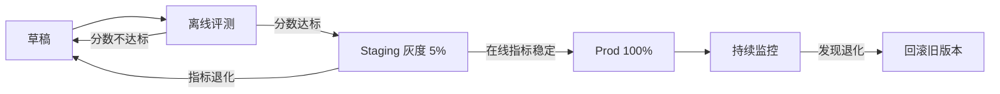
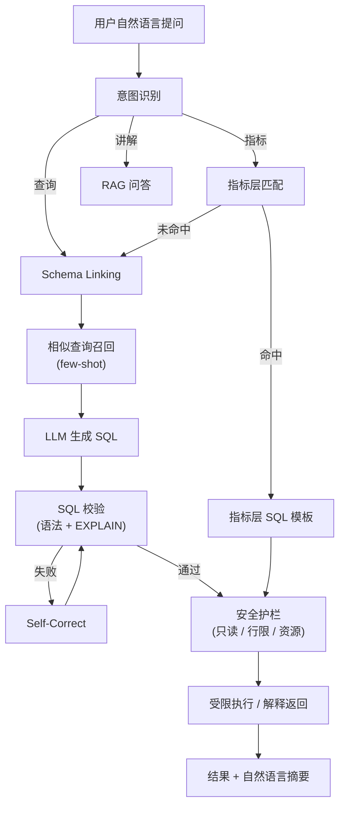
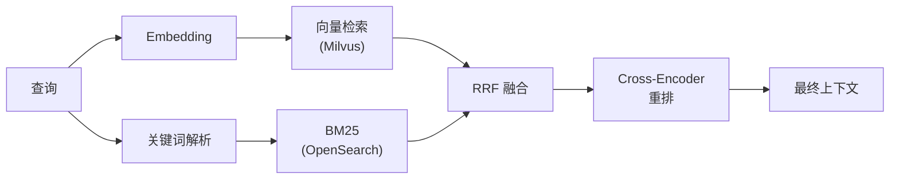
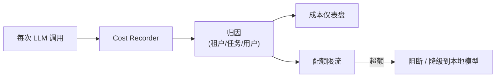

# 03 · AI 能力层设计（AI Operating System）

**适用对象**：AI 工程 / 后端 / 架构  
**前置阅读**：[`00-总体规划-v2.md`](./00-总体规划-v2.md)

---

## 目录

1. [设计哲学：AI Native](#一设计哲学ai-native)
2. [整体架构](#二整体架构)
3. [LLM Provider 抽象与路由](#三llm-provider-抽象与路由)
4. [Prompt 治理](#四prompt-治理)
5. [工业级 NL2SQL](#五工业级-nl2sql)
6. [RAG 与语义搜索](#六rag-与语义搜索)
7. [Agent 与 MCP](#七agent-与-mcp)
8. [LLMOps（成本 / 缓存 / 评测 / Fallback）](#八llmops)
9. [安全红线](#九安全红线)

---

## 一、设计哲学：AI Native

> v1 把 AI 当成"侧边栏的几个功能按钮"，v2 把 AI 当成**整个治理流程的内嵌引擎**。

| 维度 | v1 模式（功能化） | v2 模式（操作系统化） |
|---|---|---|
| AI 形态 | 几个 Provider + 几个调用 | 抽象层 + 路由 + Prompt 仓 + Agent + LLMOps |
| 调用方式 | 用户主动点按钮 | 后台自动巡检 + 用户主动 + IDE/Copilot 调用 |
| 信任模式 | 直接采纳 LLM 输出 | 评测 + 缓存 + 审核 + 熔断 |
| 数据安全 | 简单提"敏感数据" | 网关级敏感扫描 + 默认私有部署 |
| 暴露方式 | 内部 API | **MCP 协议**对外暴露能力 |

---

## 二、整体架构

```mermaid
flowchart TB
    subgraph IN["输入"]
        UI[Web UI]
        API[业务模块 API]
        SCHED[定时巡检 Agent]
        IDE["IDE / Copilot<br/>(MCP Client)"]
    end

    subgraph AISRV["AI 能力中台"]
        ROUTER["LLM Router<br/>(Provider 抽象 / 路由 / Fallback / 限流)"]
        PROMPT["Prompt Registry<br/>(版本 / 评测 / 灰度)"]
        RAG["RAG Pipeline<br/>(检索 / 重排 / 召回)"]
        AGENT["Agent Runtime<br/>(MCP Tools / 工作流)"]
        SAFE["敏感数据网关<br/>(扫描 / 脱敏 / 审计)"]
        CACHE["语义缓存<br/>(Embedding 相似度)"]
    end

    subgraph LLMOPS["LLMOps 平台"]
        EVAL["评测中心<br/>(评测集 / 自动评分)"]
        COST[成本仪表盘]
        TRACE["调用链路追踪<br/>(Langfuse)"]
        QUOTA[配额限流]
    end

    subgraph LLMS["LLM 提供方"]
        OAI[OpenAI / Azure]
        ANT[Anthropic Claude]
        QW[通义 / 文心 / 智谱]
        OLM[Ollama / vLLM<br/>(私有)]
        CUSTOM[自定义 OpenAI 兼容]
    end

    subgraph DATA["数据"]
        OM[OpenMetadata]
        MIL[Milvus]
        OS[OpenSearch]
        PG[PostgreSQL]
    end

    UI --> SAFE
    API --> SAFE
    SCHED --> SAFE
    IDE --> AGENT
    SAFE --> ROUTER
    SAFE --> RAG
    SAFE --> AGENT
    AGENT --> ROUTER
    RAG --> ROUTER
    RAG --> MIL
    RAG --> OS
    RAG --> OM
    AGENT --> OM
    AGENT --> PG
    ROUTER --> CACHE
    ROUTER --> PROMPT
    ROUTER --> OAI
    ROUTER --> ANT
    ROUTER --> QW
    ROUTER --> OLM
    ROUTER --> CUSTOM
    ROUTER --> TRACE
    ROUTER --> COST
    ROUTER --> QUOTA
    PROMPT --> EVAL
```

---

## 三、LLM Provider 抽象与路由

### 3.1 协议统一为 OpenAI 兼容

> 任何 LLM（包括 Anthropic、通义、文心、私有部署）都应通过**OpenAI Chat Completions 兼容协议**接入。

理由：

- 业界事实标准
- 客户端 SDK 统一（`openai` Python lib + `base_url` 切换）
- LiteLLM、OneAPI、新一站等网关已经做好转换

实现：

```python
# backend/ai/llm/router.py
class LLMRouter:
    def __init__(self, providers: dict[str, ProviderConfig]):
        self.providers = providers

    async def chat(self, *,
                   task: str,
                   messages: list[Message],
                   tenant_id: str,
                   trace_id: str,
                   **kwargs) -> ChatResponse:
        # 1) 任务路由：选 Provider
        provider = self._route_by_task(task, tenant_id)

        # 2) 配额检查
        await Quota.check(tenant_id, task, provider)

        # 3) 缓存命中？
        if cached := await SemanticCache.get(messages, provider.model):
            return cached

        # 4) Prompt 模板渲染（如果传的是模板 ID）
        messages = await PromptRegistry.maybe_render(messages)

        # 5) 调用 + 重试 + Fallback
        try:
            resp = await provider.client.chat(messages=messages, **kwargs)
        except (RateLimitError, ServerError) as e:
            resp = await self._fallback(task, messages, **kwargs)

        # 6) 写缓存 + 评测 + 计费 + Trace
        await SemanticCache.set(messages, provider.model, resp)
        await Trace.record(trace_id, task, provider, resp)
        await Cost.charge(tenant_id, task, resp.usage)
        return resp
```

### 3.2 任务路由策略

```yaml
# config/llm.yaml
llm:
  default_provider: ollama-internal

  providers:
    openai-azure:
      protocol: openai
      base_url: https://xxx.openai.azure.com
      api_key: ${AZURE_API_KEY}
      model: gpt-4o
      latency_p95_ms: 3000
      cost_per_1k_input: 0.005
      cost_per_1k_output: 0.015

    anthropic:
      protocol: openai
      base_url: ${LITELLM_URL}/anthropic
      api_key: ${LITELLM_KEY}
      model: claude-sonnet-4
      latency_p95_ms: 4000

    ollama-internal:
      protocol: openai
      base_url: http://ollama.svc:11434/v1
      model: qwen2.5:32b
      latency_p95_ms: 6000
      cost_per_1k_input: 0
      cost_per_1k_output: 0

    qwen:
      protocol: openai
      base_url: https://dashscope.aliyuncs.com/compatible-mode/v1
      api_key: ${DASHSCOPE_KEY}
      model: qwen-max

  task_routing:
    annotation:
      primary: ollama-internal
      fallback: [anthropic, qwen]
      max_retries: 2
    nl2sql:
      primary: anthropic
      fallback: [openai-azure, qwen]
      reasoning: "高准确率优先"
    embedding:
      primary: openai-azure
      fallback: [ollama-internal]
    chat:
      primary: ollama-internal
    pii_classify:
      primary: ollama-internal
      reasoning: "样本数据严禁出网"

  routing_policy:
    sensitive_data: ollama-internal-only   # 命中敏感扫描时强制用本地
    cost_sensitive: ollama-internal-first
    latency_sensitive: anthropic           # 高质量低延迟
```

### 3.3 Fallback 策略

| 触发条件 | 策略 |
|---|---|
| 超时（> p99 × 1.5） | 切 Fallback |
| 限流 / 429 | 切 Fallback |
| 服务器错误 5xx | 重试 1 次 → Fallback |
| 输出格式校验失败 | 同模型重试 1 次 → Fallback |
| 评测分数 < 阈值 | 进入"待人工 review" |

---

## 四、Prompt 治理

### 4.1 为什么要治理 Prompt

- Prompt 是新形态的"代码"，未版本化 = 没法回滚
- 业务方修改 Prompt 不应改后端代码
- 上线前必须有评测，避免"调一行词就上"

### 4.2 Prompt Registry 设计

```sql
CREATE TABLE prompt_template (
    id              VARCHAR(64) PRIMARY KEY,         -- e.g. annotation.column.v3
    name            VARCHAR(128),
    version         INT,
    status          VARCHAR(16),                     -- draft / staging / prod / deprecated
    body            TEXT,                            -- Jinja2 模板
    inputs_schema   JSONB,                           -- 入参 JSON Schema
    output_schema   JSONB,                           -- 期望输出格式
    eval_set_id     VARCHAR(64),                     -- 关联评测集
    eval_score      NUMERIC(4,3),                    -- 上次评测得分
    owner           VARCHAR(64),
    created_at      TIMESTAMP,
    promoted_at     TIMESTAMP
);

CREATE TABLE prompt_call_log (
    id              BIGSERIAL PRIMARY KEY,
    template_id     VARCHAR(64),
    tenant_id       VARCHAR(64),
    trace_id        VARCHAR(64),
    rendered_prompt TEXT,
    response        TEXT,
    latency_ms      INT,
    cost_usd        NUMERIC(10,6),
    eval_score      NUMERIC(4,3),
    user_feedback   INT,                             -- 1=赞 -1=踩
    created_at      TIMESTAMP DEFAULT now()
);
```

### 4.3 模板示例（字段注释生成）

```jinja
你是资深数据架构师。基于下列字段元数据和样本，生成中文字段说明。

# 字段
- 库.表：{{ database }}.{{ table }}
- 字段名：{{ column_name }}
- 类型：{{ data_type }}
- 表注释：{{ table_comment | default("无") }}
- 同表其他字段：{{ sibling_columns | join(", ") }}

# 样本（已脱敏，仅前 5 个非空值）
{{ samples | tojson }}

# 业务术语候选（向量检索 Top-5）
{{ glossary_candidates | tojson }}

# 输出要求
- JSON 格式，字段：name_cn, description, possible_pii(true/false), confidence(0-1)
- description 不超过 50 字
- 如不能确定，confidence 标低，不要编造
```

### 4.4 Prompt 上线流程



### 4.5 工具

- **Langfuse**（自部署）：开源，Trace + Prompt 管理 + 评测一体
- **PromptLayer / Helicone**：SaaS 备选
- **自研**：复杂业务可在 Langfuse 之上做轻量壳

---

## 五、工业级 NL2SQL

> v1 是"传 Schema + 调 LLM"。v2 把 NL2SQL 做成**端到端的工业级 Pipeline**。

### 5.1 完整流程



### 5.2 各阶段细节

#### 5.2.1 Schema Linking

不是把全库 Schema 都喂给 LLM（成本爆炸 + 准确率反而下降）：

1. **向量检索**：用户问题 embedding → 召回 Top-10 相关表
2. **字段精排**：基于字段名 + 注释 + 样本 + 业务术语，重排 Top-30 字段
3. **上下文构造**：仅把 Top-10 表 + Top-30 字段送进 Prompt

#### 5.2.2 Few-shot 检索

- 历史成功 SQL（用户点赞或被采用的）入向量库
- 当前问题相似度 Top-3 作为 few-shot 示例

#### 5.2.3 指标层优先

```yaml
# 用户问："上周北京的 GMV 是多少"
# 平台优先匹配指标层 metric=gmv_daily
# 直接走指标层 SQL 模板，避免 LLM 生成错误的明细 SQL：
SELECT SUM(amount) AS gmv
FROM dwd_db.dwd_order_detail
WHERE is_valid = 1
  AND city_id = (SELECT city_id FROM dim_city WHERE city_name='北京')
  AND dt BETWEEN '${week_start}' AND '${week_end}'
```

**好处**：

- 口径统一、避免重复定义
- 性能更好（已聚合或已优化）
- 安全可控（不直查明细表）

#### 5.2.4 SQL 校验与 Self-Correct

```python
async def validate_and_correct(sql: str, dialect: str, max_iter=3):
    for i in range(max_iter):
        # 1) 语法解析
        try:
            ast = sqlglot.parse_one(sql, dialect=dialect)
        except Exception as e:
            sql = await llm_fix(sql, error=str(e))
            continue
        # 2) 列名 / 表名校验
        errors = check_against_metadata(ast)
        if errors:
            sql = await llm_fix(sql, error=errors)
            continue
        # 3) EXPLAIN 试跑
        try:
            await engine.explain(sql)
        except Exception as e:
            sql = await llm_fix(sql, error=str(e))
            continue
        return sql
    raise NL2SQLValidationError("Self-correct exceeded max iterations")
```

#### 5.2.5 安全护栏

| 护栏 | 说明 |
|---|---|
| **只读账号** | NL2SQL 执行账号无写权限 |
| **强制分区过滤** | 必须有 `dt = ?` 等分区谓词，否则拒绝 |
| **行数上限** | 自动 `LIMIT 1000` |
| **资源队列** | 走 Trino 专用 NL2SQL 队列，CPU / 内存上限 |
| **超时熔断** | 30 秒未完成强制 cancel |
| **PII 字段拦截** | 敏感字段需高权限用户 + 审计 |

### 5.3 评测体系

| 评测维度 | 方法 |
|---|---|
| **Execution Accuracy** | 生成 SQL 在测试库执行后结果是否与标准答案一致 |
| **Exact Match** | 字符串/AST 级匹配 |
| **Schema Hit Rate** | Schema Linking 命中率 |
| **Hallucination Rate** | 是否引用了不存在的表/字段 |
| **Safety** | 是否触发安全护栏 |

测试集来源：

- 社区 Spider / BIRD（基础能力）
- 内部历史 BI 查询日志（业务语义）
- 故意构造的"陷阱集"（同义不同义、口径冲突）

---

## 六、RAG 与语义搜索

### 6.1 知识源与切分

| 来源 | 切分策略 |
|---|---|
| 表元数据 | 一表一文档，含 schema + 注释 + 标签 |
| 字段元数据 | 一字段一文档（高频检索单位） |
| 业务术语 | 一术语一文档 |
| SQL / dbt 模型 | 按模型切，附带血缘上下文 |
| 文档 / Wiki | Markdown 按 H2/H3 切，512 tokens 一段，重叠 10% |
| 历史问答 | 一问一答 |

### 6.2 多向量与混合检索



- **Embedding 模型**：bge-m3 / text-embedding-3-large（私有部署优先 bge）
- **多向量**：每个字段同时存 `name_emb` / `comment_emb` / `business_emb`，融合检索
- **混合检索**：Vector + BM25 走 **Reciprocal Rank Fusion (RRF)**
- **Reranker**：bge-reranker-v2 / Cohere Rerank，Top-30 → Top-10

### 6.3 Embedding 增量更新

> v1 没提增量，规模大了每天全量重建会很贵。

```python
# Schema 变更事件 → 增量 embedding
async def on_metadata_change(event: MetadataChangeEvent):
    if event.entity_type in ("Table", "Column"):
        doc = build_embedding_doc(event.entity)
        emb = await llm_router.embed(doc.text, task="embedding")
        await milvus.upsert(
            collection="metadata",
            data={"id": doc.id, "vec": emb, "meta": doc.meta}
        )
```

定时任务：

- 增量：每 15 分钟消费 Schema 变更事件
- 全量：每周日凌晨重建（Reindex），保证一致性

### 6.4 用户意图与个性化

- 不同角色召回偏好不同（数据工程师偏明细表，业务分析师偏指标层）
- 上下文中加入用户最近访问的表 / 部门 / 项目
- 会话级记忆（多轮对话同一会话表上下文复用）

---

## 七、Agent 与 MCP

### 7.1 为什么要 Agent

> 治理工作"流程长、跨模块"，单步 LLM 调用解决不了：发现问题 → 根因 → 写 SQL 修复 → 提 PR → 通知 Owner → 验证。

Agent 把这些步骤串起来。

### 7.2 MCP 协议

**Model Context Protocol** 是开放标准，把"工具"暴露给任何 MCP Client（Cursor、Claude Desktop、VS Code Copilot、自研 IDE 插件）。

平台暴露的 MCP Tools 示例：

| Tool | 说明 |
|---|---|
| `search_assets(query)` | 资产搜索 |
| `get_table_schema(fqn)` | 取表 Schema |
| `get_lineage(fqn, depth)` | 取血缘 |
| `run_data_profile(fqn, sampling)` | 触发探查 |
| `evaluate_dq_rule(rule_id, dt)` | 跑质量规则 |
| `propose_dq_rules(fqn)` | AI 推荐质量规则 |
| `nl_to_sql(question)` | 自然语言转 SQL |
| `propose_field_annotation(fqn)` | 生成字段注释 |
| `create_governance_ticket(payload)` | 创建治理工单 |
| `get_metric(name, dimensions, period)` | 查询指标 |

### 7.3 内置 Agent

| Agent | 触发 | 能力 |
|---|---|---|
| **DailyHealthAgent** | 每日 8:00 | 扫昨日 SLA、漂移、新问题，生成日报 |
| **AnnotationAgent** | 新表入库 | 自动生成字段注释，分高/中/低置信度 |
| **DQRecommendAgent** | 新表入库 + 用户触发 | 推荐应用哪些质量规则 |
| **ImpactAgent** | 用户提交变更预告 | 自动生成下游影响清单 + 通知列表 |
| **RootCauseAgent** | 工单创建 | 拉血缘 + 上游变更 + 历史相似工单，给疑似原因 |
| **ComplianceAgent** | 定期 + 用户请求 | DSAR 数据足迹、PII 链路扫描 |

### 7.4 Agent 编排

走**有限步骤工作流**而非纯 ReAct（避免无限循环 / token 爆炸）：

```python
class DQRecommendAgent(Agent):
    max_steps = 8
    tools = ["get_table_schema", "run_data_profile",
             "search_similar_tables", "propose_dq_rules",
             "create_governance_ticket"]

    system_prompt = "你是数据质量专家..."

    async def run(self, table_fqn: str):
        steps = [
            ("get_schema",   "get_table_schema",   {"fqn": table_fqn}),
            ("profile",      "run_data_profile",   {"fqn": table_fqn, "sampling": "auto"}),
            ("similar",      "search_similar_tables", {"fqn": table_fqn, "topk": 5}),
            ("propose",      "propose_dq_rules",
                {"context": "$.steps[*].output"}),
        ]
        return await self.execute_workflow(steps)
```

### 7.5 人机协同

> Agent 不是"全自动"，关键动作需要人审：

| 动作 | 人工审批 |
|---|---|
| 注释 / 标签 | 高置信度自动入库，低置信度入审核队列 |
| DQ 规则上线 | 推荐 → Owner 审批 → 上线 |
| SQL 修复 | 仅生成 PR / 草稿，人工 review |
| 数据归档 / 删除 | 必须双人审批 |
| 任何对外通知 | 默认 dry-run，人工确认 |

---

## 八、LLMOps

### 8.1 成本治理



实现：

- 每次调用记录 input_tokens / output_tokens / model / cost
- 多维聚合：租户 / 任务 / 模块 / 用户
- 月度配额（金额 + token 上限）
- 超额自动降级到本地模型 + 告警

### 8.2 语义缓存

| 层级 | Key | 适用 |
|---|---|---|
| L1 完全等价 | hash(messages, model) | 重复调用 |
| L2 语义相似 | embedding 相似度 > 0.95 | 同义不同表述 |
| L3 模板级 | template_id + args hash | Prompt 模板调用 |

**注意**：

- 缓存 TTL 区分任务（注释 7 天，NL2SQL 1 天，因 Schema 会变）
- 元数据变更事件触发缓存失效（精确失效 vs. 全部失效要权衡）

### 8.3 评测中心

```yaml
eval_suite:
  name: nl2sql.daily
  prompt_template: nl2sql.v3
  test_cases:
    - id: case-001
      input: "上周北京的 GMV"
      expected_sql: "SELECT ..."
      expected_result: 12345.67
  metrics:
    - execution_accuracy
    - exact_match
    - hallucination
  gates:
    execution_accuracy: ">=0.85"
    hallucination: "<=0.05"
  schedule: "0 4 * * *"
```

每日跑评测，分数掉到 gate 以下：

- 自动告警
- 阻止当前 Prompt 版本继续放量
- 触发版本回滚

### 8.4 链路追踪

每次 AI 调用必须有 `trace_id`，串联：

- 用户请求
- Schema Linking 检索
- LLM 调用（多次）
- SQL 校验 / 执行
- 结果

工具：**Langfuse** 或 **OpenTelemetry + Jaeger**。

### 8.5 输出格式可靠性

- **强类型 JSON 输出**：用 `response_format={"type":"json_schema",...}`（OpenAI）/ Tool Calling
- 兜底：失败时正则提取 + sanitize
- 关键决策必须返回 `confidence`，便于阈值化处理

---

## 九、安全红线

### 9.1 数据出网分级

| 数据类型 | 外部商用 API | 私有 LLM | 备注 |
|---|---|---|---|
| 表名 / 字段名 / 注释 | ⚠️ 需脱敏关键字 | ✅ | 默认走脱敏 |
| 业务术语 / 标签 | ✅ | ✅ | |
| 探查统计值（min/max/分布）| ⚠️ 无 PII 才行 | ✅ | |
| **原始样本数据** | ❌ **严禁** | ⚠️ 可控 | 强制网关拦截 |
| **生产 SQL** | ⚠️ 需扫敏感 | ✅ | |
| 用户个人数据 | ❌ | ⚠️ 高权限 | |

### 9.2 敏感数据网关

所有 LLM 出站请求都过网关：

```python
class SensitiveDataGateway:
    rules = [
        IDCardRegex(),
        PhoneRegex(),
        EmailRegex(),
        PiiDictionary(),       # 自维护词典
        AICheckRule(),         # 不确定时调小模型校验
    ]

    async def scrub(self, payload: dict) -> tuple[dict, list[Hit]]:
        hits = []
        for rule in self.rules:
            payload, h = rule.scrub(payload)
            hits.extend(h)
        if any(h.severity == "block" for h in hits):
            raise SensitiveDataBlocked(hits)
        return payload, hits
```

### 9.3 默认私有部署

生产环境**默认所有 LLM 任务走私有部署**（vLLM / Ollama / 魔搭），仅以下场景可外部 API：

- 内部研发的"非生产数据"探索（如离线分析公开数据）
- 经过审批的特定任务，且数据已脱敏

### 9.4 审计

每次 LLM 调用必须记录：

- `tenant_id` / `user_id` / `task` / `model`
- 输入摘要（Hash + 长度）+ 命中的敏感扫描结果
- 输出摘要 + cost
- 是否触发了 fallback / 缓存

审计日志保留 ≥ 1 年，对接合规。

详见 [`04-安全与合规.md`](./04-安全与合规.md)。

---

> 上一篇：[`02-数据质量与血缘.md`](./02-数据质量与血缘.md)  
> 下一篇：[`04-安全与合规.md`](./04-安全与合规.md)
