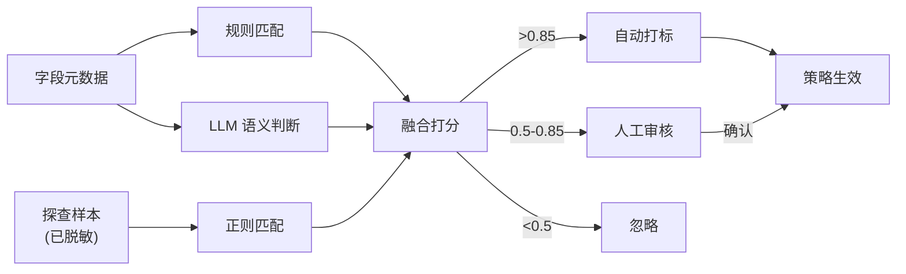
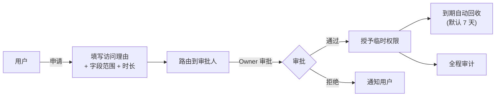
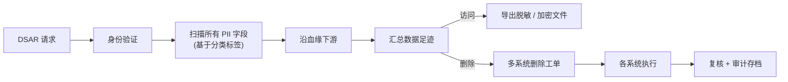

# 04 · 安全与合规

**适用对象**：安全 / 合规 / 架构 / 后端  
**前置阅读**：[`00-总体规划-v2.md`](./00-总体规划-v2.md)

---

## 目录

1. [合规框架](#一合规框架)
2. [数据分级分类](#二数据分级分类)
3. [脱敏策略（静态 + 动态）](#三脱敏策略)
4. [访问控制（RBAC + ABAC）](#四访问控制)
5. [SSO 与身份治理](#五sso-与身份治理)
6. [审计日志](#六审计日志)
7. [合规支持（个保法 / GDPR / DSAR）](#七合规支持)
8. [LLM 调用安全](#八llm-调用安全)
9. [密钥与凭据管理](#九密钥与凭据管理)

---

## 一、合规框架

平台需对齐以下法规与标准：

| 法规 / 标准 | 要点 |
|---|---|
| 《个人信息保护法》 | 个人信息处理告知 / 同意 / 最小必要 / 出境评估 |
| 《数据安全法》 | 数据分级分类、重要数据保护 |
| 《网络安全法》 | 等保 2.0、日志留存 ≥ 6 个月 |
| GB/T 35273 | 个人信息安全规范，敏感个人信息定义 |
| GB/T 37988（DSMM） | 数据安全能力成熟度模型 |
| GDPR（如有海外业务） | 数据主体权利、被遗忘权、可携带权 |
| ISO 27001 / SOC 2 | 信息安全管理体系 |
| 等保 2.0 三级 | 大多数生产环境基线 |

---

## 二、数据分级分类

### 2.1 分级标准（参考 GB/T 35273 + DSMM）

| 等级 | 名称 | 示例 | 处理要求 |
|---|---|---|---|
| **L1 公开** | 可对外公开 | 公司介绍、产品名 | 无特殊要求 |
| **L2 内部** | 仅内部可见 | 部门组织、内部 Wiki | 内网访问 |
| **L3 敏感** | 限受控人员 | 销售数据、未公开报表 | 申请审批 + 审计 |
| **L4 机密** | 严格受控 | 财务、人事工资、个人信息 | 双人审批 + 静态脱敏 |
| **L5 绝密** | 极少数人 | 核心算法、未发布战略 | 物理隔离 |

### 2.2 个人信息分类（GB/T 35273）

| 类别 | 示例 |
|---|---|
| **一般个人信息** | 姓名、用户名、出生日期 |
| **敏感个人信息** | 身份证号、手机号、家庭住址、银行账户、健康记录、行踪轨迹、生物识别 |

> 敏感个人信息处理需 **明确同意**、**目的限定**、**最小必要**。

### 2.3 自动分级分类引擎



### 2.4 标签体系

```yaml
classifications:
  - name: PII
    sub_categories:
      - id: pii.id_card
        display: 身份证号
        sensitivity: L4
        masking: id_card_partial
      - id: pii.phone
        display: 手机号
        sensitivity: L3
        masking: phone_partial
      - id: pii.bank_account
        display: 银行账户
        sensitivity: L4
        masking: bank_full
      - id: pii.address
        display: 详细地址
        sensitivity: L3
        masking: address_partial

  - name: Business
    sub_categories:
      - id: biz.gmv
        display: 营收类
        sensitivity: L3
      - id: biz.cost
        display: 成本类
        sensitivity: L4
```

### 2.5 数据资产定级流程

1. 自动分级（v2.3 引擎）→ 80% 字段一次到位
2. Owner 复核（剩余 20% 走人工）
3. 季度复审（业务变化、数据漂移）
4. 异议申诉机制

---

## 三、脱敏策略

### 3.1 静态脱敏 vs 动态脱敏

| 维度 | 静态脱敏 | 动态脱敏 |
|---|---|---|
| 时机 | 数据入库 / 同步时 | 查询时按角色脱敏 |
| 适用 | 探查样本、测试环境同步、报告导出 | 生产查询、BI 看板 |
| 实现 | ETL / 平台采样模块 | 查询代理 / Apache Ranger / 自研中间层 |
| 性能影响 | 一次性 | 每次查询 |

### 3.2 脱敏算法

| 算法 | 示例 |
|---|---|
| **置空** | NULL（最低成本，丢失最多）|
| **掩码** | `138****1234`、`110101********1234` |
| **哈希** | SHA-256 + Salt（保留可比性，不可逆）|
| **格式保留加密 (FPE)** | 加密后仍是 11 位手机号格式（可逆，需密钥）|
| **泛化** | 出生日期 → 出生年份 |
| **K-匿名** | 至少 K 条记录无法区分 |
| **差分隐私** | 加噪声，统计可用、个体不可识别 |

### 3.3 脱敏规则配置

```yaml
masking_rules:
  - tag: pii.id_card
    static: hash_with_salt
    dynamic:
      role:guest: hash
      role:analyst: mask              # 110101********1234
      role:auditor: full              # 完整可见 + 审计
  - tag: pii.phone
    static: mask
    dynamic:
      role:guest: hash
      role:analyst: mask
      role:owner: full
  - tag: pii.bank_account
    static: hash
    dynamic:
      default: deny                   # 默认拒绝
      role:finance_admin: full
```

### 3.4 探查阶段强制脱敏

> 探查产生的样本会被持久化（用于分析、AI 注释、Top-N 展示），**必须先脱敏再入库**：

```python
def store_sample(column: ColumnMeta, raw_values: list):
    if column.has_tag("pii.*"):
        rule = MaskingPolicy.for_column(column)
        masked = [rule.apply(v) for v in raw_values]
    else:
        masked = raw_values
    Storage.put(column.fqn, masked)
```

原始样本**不写入磁盘**。

### 3.5 动态脱敏接入点

| 场景 | 实现 |
|---|---|
| 平台内 SQL 查询 | 平台查询代理层应用脱敏视图 |
| Trino / Hive | Apache Ranger Policy + Column Masking |
| BI 工具直连数仓 | 使用脱敏视图（`v_*` 前缀），用户只能查 view |

---

## 四、访问控制

### 4.1 RBAC 基础

| 角色 | 范围 |
|---|---|
| `platform_admin` | 平台超管 |
| `tenant_admin` | 租户管理员 |
| `data_owner` | 数据资产所有者 |
| `data_steward` | 数据治理负责人 |
| `dq_engineer` | 数据质量工程师 |
| `analyst` | 数据分析师 |
| `viewer` | 只读浏览 |
| `auditor` | 审计员（可看审计日志，不可改）|

### 4.2 ABAC 补充

> RBAC 解决"角色"，ABAC 解决"上下文"：

```yaml
policy:
  id: pii_query_policy
  effect: allow
  subject:
    role: analyst
  resource:
    type: table
    tags: ["pii.*"]
  condition:
    - request.purpose in ["risk_review", "compliance_audit"]
    - subject.department == resource.owner_department
    - request.time within "08:00-22:00"
    - subject.training_status == "completed"
  obligation:
    - record_audit
    - notify_owner
```

实现可选：

- **Casbin**（轻量、Python/Go 都好用）
- **OPA (Open Policy Agent)**（标准化 Rego 策略，企业级）
- **自研薄层**（基于 SQL + 缓存）

### 4.3 数据访问申请流



要点：

- **目的标注**：每次申请必须填业务用途
- **字段级粒度**：可申请到字段，不只是表
- **临时权限**：默认 7 天，最长 30 天，到期自动回收
- **二次审批**：L4 数据需要 Owner + 安全双审

---

## 五、SSO 与身份治理

### 5.1 SSO 选型

| 方案 | 推荐度 |
|---|---|
| **Keycloak** | ⭐⭐⭐⭐⭐ 自部署首选，OAuth2/OIDC/SAML 全支持 |
| **Casdoor** | ⭐⭐⭐⭐ 国产、轻量 |
| **Authentik** | ⭐⭐⭐ 现代化 UI |
| 自研用户体系 | ❌ 强烈不建议 |

### 5.2 集成方式

- 平台所有 API 走 OAuth2 / OIDC（Bearer Token）
- 前端走 Authorization Code Flow + PKCE
- 后端通过 Token Introspection 验证
- 与企业 LDAP / AD / 飞书 / 钉钉 / 企微集成（Keycloak 内置 Federation）

### 5.3 用户与组织同步

- HR 系统 / OA 为权威源
- SCIM 2.0 协议自动同步用户、部门、组
- 组织变动事件 → 自动调整数据访问权限（如：换部门后 14 天内回收旧部门数据访问权）

---

## 六、审计日志

### 6.1 必审计动作

| 类别 | 示例 |
|---|---|
| 鉴权 | 登录 / 登出 / 失败 |
| 元数据变更 | 字段标签变更、Owner 变更、标准绑定 |
| 数据访问 | 样本查看、SQL 执行、报告下载 |
| 权限变更 | 角色赋予 / 撤销、申请审批 |
| LLM 调用 | 任务、模型、命中敏感扫描 |
| 配置变更 | 数据源接入、脱敏策略、规则变更 |
| 治理工单 | 创建 / 流转 / 关闭 |

### 6.2 数据模型

```sql
CREATE TABLE audit_log (
    id              BIGSERIAL PRIMARY KEY,
    tenant_id       VARCHAR(64) NOT NULL,
    actor_id        VARCHAR(64) NOT NULL,
    actor_ip        VARCHAR(64),
    actor_ua        VARCHAR(256),
    action          VARCHAR(64) NOT NULL,        -- e.g. table.view_sample
    resource_type   VARCHAR(64),
    resource_id     VARCHAR(512),
    purpose         VARCHAR(256),
    result          VARCHAR(16),                  -- success / denied / error
    detail          JSONB,
    trace_id        VARCHAR(64),
    occurred_at     TIMESTAMP DEFAULT now()
) PARTITION BY RANGE (occurred_at);

CREATE INDEX idx_audit_actor ON audit_log(tenant_id, actor_id, occurred_at DESC);
CREATE INDEX idx_audit_resource ON audit_log(tenant_id, resource_type, resource_id);
CREATE INDEX idx_audit_action ON audit_log(tenant_id, action, occurred_at DESC);
```

### 6.3 审计基础设施

- **写**：FastAPI 中间件 + 后端服务事件总线统一写
- **存**：PostgreSQL 月度分区 + 归档到 OpenSearch（便于检索）+ 长期归档到对象存储
- **保留期**：合规要求 ≥ 6 个月，建议 1-3 年
- **不可篡改**：审计库走独立账号 + 只追加（无 UPDATE / DELETE 权限）+ 哈希链

### 6.4 审计可视化

- 行为时间线（按用户 / 资源）
- 高危操作仪表盘（PII 查询频次、跨部门访问、深夜操作）
- 异常检测：UEBA（用户行为分析）—— 可走 AI Agent

---

## 七、合规支持

### 7.1 DSAR（数据主体请求）

| 请求类型 | 平台能力 |
|---|---|
| **访问权**：用户要求查看自身数据 | 给定 user_id，列出该用户在所有表中的字段链路 |
| **更正权**：要求修正数据 | 触发各源系统更新流程 |
| **删除权 / 被遗忘权** | 沿血缘下游识别所有副本，统一删除任务 |
| **可携带权** | 导出标准化 JSON / CSV |
| **限制处理** | 临时打"冻结"标签，DQ / AI 任务跳过 |

### 7.2 实现要点



### 7.3 数据出境评估（个保法）

平台需支持：

- 数据出境清单（哪些表 / 字段会出境）
- 数据出境影响评估（PIA）报告生成
- LLM 出网行为视为"出境"（如调用海外模型 API），强校验 + 审批

---

## 八、LLM 调用安全

详见 [`03-AI能力层设计.md § 九、安全红线`](./03-AI能力层设计.md#九安全红线)，本节补充合规视角：

### 8.1 LLM 与个保法

| 场景 | 合规要求 |
|---|---|
| 把含 PII 的样本送外部 LLM | **必须经过用户同意 + 出境评估**；建议直接禁止 |
| 把生产 SQL 送外部 LLM | 视为"业务数据"，需要审批 + 脱敏 |
| 用 LLM 生成的注释回写到平台 | 注释中可能含 LLM 编造的"PII"，需要校验 |

### 8.2 强制策略

```yaml
llm_security:
  external_provider_policy:
    pii_data: deny              # 命中 PII 直接拒绝
    business_sensitive: review  # 业务敏感入审批
    public: allow

  prompt_filter:
    enabled: true
    rules:
      - block_keywords: ["身份证", "银行卡", "密码", "passwd"]
      - max_tokens_per_call: 8000
      - max_calls_per_user_minute: 60

  output_filter:
    enabled: true
    rules:
      - strip_unverified_facts: true   # 标注"AI 生成，待人工确认"
      - require_confidence_score: true
```

---

## 九、密钥与凭据管理

### 9.1 必管密钥

| 类型 | 示例 |
|---|---|
| 数据源密码 | Hive / MySQL / Iceberg Catalog |
| LLM API Key | OpenAI / Anthropic / 通义 |
| 对象存储 Key | MinIO / S3 |
| Kerberos Keytab | Hadoop |
| TLS 证书 | 平台证书 |
| 加密密钥 | 字段级加密 / 脱敏 |

### 9.2 选型

| 方案 | 推荐度 |
|---|---|
| **HashiCorp Vault** | ⭐⭐⭐⭐⭐ 标准方案，动态密钥、Lease |
| **Kubernetes Secrets + Sealed Secrets** | ⭐⭐⭐ 简化版本 |
| **云厂商 KMS（阿里云 KMS / AWS KMS）** | ⭐⭐⭐⭐ 已上云首选 |
| 配置文件明文 | ❌ 严禁 |

### 9.3 关键实践

- 密钥**不写入代码 / Git**（pre-commit hook 扫描）
- **短期凭据**：Vault 动态密钥，TTL ≤ 24 小时
- **轮转**：API Key 每 90 天轮转
- **最小权限**：每个连接器 / 任务独立账号
- **审计**：密钥使用全程记录

---

> 上一篇：[`03-AI能力层设计.md`](./03-AI能力层设计.md)  
> 下一篇：[`05-部署与运维.md`](./05-部署与运维.md)
