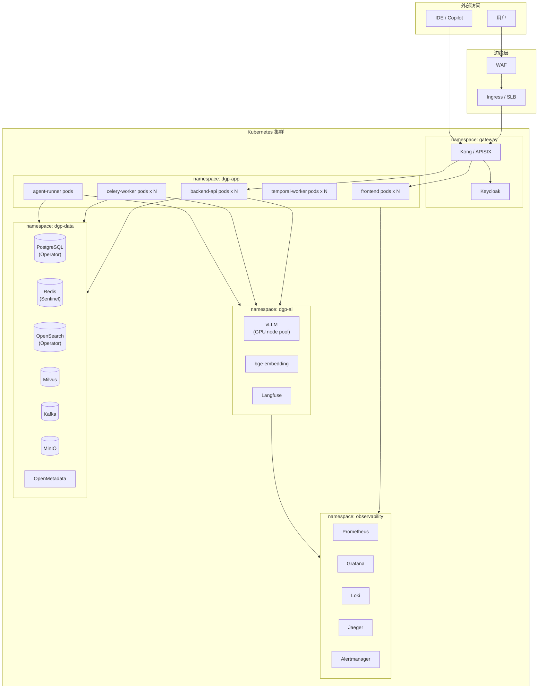
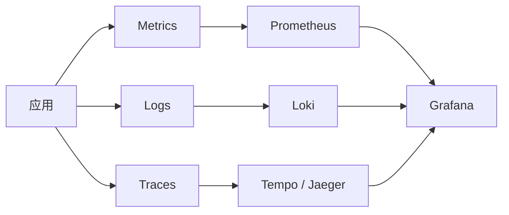
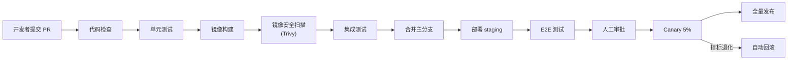

# 05 · 部署与运维

**适用对象**：DevOps / SRE / 架构  
**前置阅读**：[`00-总体规划-v2.md`](./00-总体规划-v2.md)

---

## 目录

1. [部署模式](#一部署模式)
2. [Kubernetes 部署架构](#二kubernetes-部署架构)
3. [多租户与隔离](#三多租户与隔离)
4. [配置中心与多环境](#四配置中心与多环境)
5. [可观测性（监控 / 日志 / 追踪）](#五可观测性)
6. [告警体系](#六告警体系)
7. [备份与灾备](#七备份与灾备)
8. [CI/CD](#八cicd)

---

## 一、部署模式

| 部署形态 | 适用 | 资源要求 |
|---|---|---|
| **单机 Docker Compose** | 本地开发 / POC | 8C16G + 100GB |
| **小规模 K8s（单集群）** | < 1000 张表 | 16C64G + 500GB |
| **中型 K8s（HA + 独立中间件）** | 1万级表 | 32C128G + 2TB |
| **大规模多集群** | 10万级表 + 多租户 | 多 Region 部署 |

### 1.1 开发模式（Compose）

提供一键启动脚本，包含：

- backend / frontend / worker（最小集）
- PostgreSQL / Redis / MinIO
- Mock 数据源（预置 Hive 元数据 dump）
- Ollama 本地模型（轻量 7B）

不含：OpenSearch / Milvus / Kafka（开发模式用 PostgreSQL FTS + pgvector + 内存事件代替）。

### 1.2 生产模式（K8s）

详见 § 二。

---

## 二、Kubernetes 部署架构

### 2.1 架构图



### 2.2 资源规划（中型参考）

| 组件 | 副本 | 单副本资源 | 备注 |
|---|---|---|---|
| frontend | 2 | 0.5C / 512M | 前端纯静态 |
| backend-api | 4 | 2C / 4G | HPA：CPU 60% |
| celery-worker | 4 | 2C / 4G | 按队列分组 |
| temporal-worker | 2 | 1C / 2G | 工作流执行 |
| agent-runner | 2 | 2C / 4G | LLM 调用、IO 密集 |
| postgresql | 3（HA） | 4C / 16G + 500G SSD | Patroni Operator |
| redis | 3（Sentinel） | 1C / 4G | |
| opensearch | 3 | 4C / 16G + 200G | data + master |
| milvus | 3 | 4C / 16G + 200G | standalone 或集群 |
| kafka | 3 | 2C / 8G + 100G | KRaft 模式 |
| minio | 4 | 2C / 4G + 1TB | 4 节点纠删码 |
| openmetadata | 2 | 2C / 4G | + 独立 ES + MySQL |
| vllm | 2 | 1×A10 / 32G | 7B / 32B 模型 |
| keycloak | 2 | 1C / 2G | |
| 监控栈 | - | 4-8C / 16-32G | 整体 |

> GPU 节点池单独规划，使用 K8s `nodeSelector` + `taints/tolerations` 隔离。

### 2.3 Helm Chart 设计

```
charts/
├── dgp-platform/             # 主 Chart
│   ├── Chart.yaml
│   ├── values.yaml
│   ├── values-prod.yaml
│   ├── values-staging.yaml
│   └── templates/
│       ├── backend/
│       ├── frontend/
│       ├── worker/
│       └── ...
└── dgp-stack/                # 依赖 Chart（可拆出）
    ├── postgresql/
    ├── redis/
    ├── opensearch/
    ├── milvus/
    ├── kafka/
    └── ...
```

每个微服务一个子模板，支持环境变量替换 + 配置中心拉取。

### 2.4 节点池策略

| 节点池 | 用途 | 标签 |
|---|---|---|
| `general` | 应用层（API / Worker） | `pool=general` |
| `data` | 中间件（PG / Redis / OS / Milvus / Kafka）| `pool=data` |
| `gpu` | 推理（vLLM / 嵌入）| `pool=gpu`, `nvidia.com/gpu=present` |
| `etl` | 探查 / 质量任务 | `pool=etl` |

通过 `nodeSelector` 严格分隔，避免应用层挤占数据库节点。

---

## 三、多租户与隔离

### 3.1 隔离策略选型

| 策略 | 隔离强度 | 运维成本 | 适用 |
|---|---|---|---|
| **共享库 + 行级隔离 (RLS)** | 中 | 低 | **推荐**：v2 默认 |
| 共享库 + Schema 隔离 | 中-高 | 中 | 大客户隔离 |
| 一租户一库 | 高 | 高 | 监管强相关 |
| 一租户一集群 | 极高 | 极高 | 私有化交付 |

### 3.2 行级隔离实现（PostgreSQL RLS）

```sql
-- 1) 所有业务表必须带 tenant_id
ALTER TABLE std_field_binding ENABLE ROW LEVEL SECURITY;

-- 2) 策略：只能看到自己租户的数据
CREATE POLICY tenant_isolation ON std_field_binding
    USING (tenant_id = current_setting('app.tenant_id', true));

-- 3) 应用连接每个 session 设置 tenant_id
SET app.tenant_id = 'tenant_acme';
```

后端实现：

```python
# 中间件：每次请求把 tenant_id 写入 DB session
@app.middleware("http")
async def set_tenant_context(request, call_next):
    tenant_id = extract_tenant_from_token(request)
    async with db_session() as session:
        await session.execute(text("SET app.tenant_id = :tid"), {"tid": tenant_id})
        request.state.session = session
        return await call_next(request)
```

### 3.3 缓存 / 队列隔离

- **Redis Key**：`{tenant_id}:dgp:cache:...`
- **Kafka Topic**：`dgp.{tenant_id}.metadata-events`（或全局 Topic + Header 区分）
- **OpenSearch Index**：`dgp_{tenant_id}_metadata`（小租户共享 Index + tenant 字段）
- **MinIO Bucket**：`dgp-{tenant_id}-reports`

### 3.4 资源配额

每租户：

- API QPS 上限
- 任务并发上限
- LLM 月度 Token 配额
- 存储配额（探查报告、导出文件）

通过 K8s ResourceQuota + 应用层 Quota 中间件双层控制。

---

## 四、配置中心与多环境

### 4.1 配置分层

| 层级 | 内容 | 存储 |
|---|---|---|
| 编译期常量 | 版本号、Feature Flag 默认值 | 代码 |
| 部署期配置 | DB / Redis 连接、外部服务地址 | Helm values + ConfigMap |
| 运行期配置 | 数据源、LLM Provider、规则、Prompt | **配置中心**（Nacos / Apollo） |
| 敏感凭据 | 密码 / Key | Vault / KMS |

### 4.2 多环境

| 环境 | 用途 |
|---|---|
| `dev` | 本地开发（Compose） |
| `staging` | 集成测试 + 灰度，连测试数据源 |
| `prod` | 生产 |
| `prod-dr` | 灾备（异地） |

环境间走**镜像不变 + 配置变化**：

```
镜像：dgp-backend:1.4.2  ←  同一个镜像
配置：dev / staging / prod 各自不同的 ConfigMap + Secret
```

### 4.3 Feature Flag

接入 **Unleash / FF4J** 实现：

- AI 功能灰度（先开放给特定用户 / 租户）
- 功能 Kill Switch（出问题快速关闭）
- A/B 测试（不同 Prompt 版本）

---

## 五、可观测性

### 5.1 三支柱



### 5.2 关键指标

#### 应用层

- HTTP QPS / P95 / P99 / 错误率
- 任务队列深度 / 处理延迟
- 元数据同步成功率 / 同步耗时
- DQ 检查命中率 / 平均执行时长

#### AI 层

- LLM 调用 QPS / 延迟 / 错误率（按 Provider / 模型）
- Token 消耗 / 成本（按租户 / 任务）
- 缓存命中率
- Fallback 触发率
- Prompt 评测分数

#### 数据层

- DB 连接池 / 慢查询
- Redis QPS / 命中率
- OpenSearch / Milvus 查询延迟
- Kafka 消费 Lag

#### 业务 KPI

- 资产总数 / 周新增
- 数据健康分
- 在途工单数 / 平均关闭时长
- 月活用户 / 搜索 QPS

### 5.3 日志规范

JSON 结构化日志：

```json
{
  "ts": "2026-04-28T10:23:45.123Z",
  "level": "INFO",
  "service": "backend-api",
  "tenant_id": "tenant_acme",
  "trace_id": "abc-123",
  "span_id": "...",
  "user_id": "u-100",
  "module": "ai.llm.router",
  "msg": "LLM call success",
  "fields": {
    "task": "annotation",
    "model": "qwen2.5:32b",
    "latency_ms": 1234,
    "cost_usd": 0.0015
  }
}
```

- 禁止打印 PII / 凭据 / 完整 Prompt（仅打 hash）
- 等保要求保留 ≥ 6 个月，归档到对象存储

### 5.4 链路追踪

- OpenTelemetry SDK 自动埋点（FastAPI / Celery / SQLAlchemy / requests）
- LLM 调用单独 Span（含 prompt template id、model）
- 跨服务通过 W3C TraceContext 传递

---

## 六、告警体系

### 6.1 告警分级

| 等级 | 响应时间 | 通知 |
|---|---|---|
| **P0 故障** | 5 分钟 | 电话 + 短信 + 钉钉群 |
| **P1 严重** | 30 分钟 | 钉钉 + 邮件 |
| **P2 一般** | 4 小时 | 钉钉 |
| **P3 提示** | 24 小时 | 邮件 |

### 6.2 关键告警规则（示例）

```yaml
groups:
  - name: dgp-app
    rules:
      - alert: BackendHighErrorRate
        expr: rate(http_requests_total{status=~"5.."}[5m]) > 0.05
        for: 5m
        labels:
          severity: P1
        annotations:
          summary: "Backend 5xx 错误率 > 5%"

      - alert: MetadataSyncFailure
        expr: increase(metadata_sync_failure_total[1h]) > 3
        for: 10m
        labels:
          severity: P1

      - alert: LLMFallbackRateHigh
        expr: rate(llm_fallback_total[15m]) / rate(llm_call_total[15m]) > 0.2
        for: 15m
        labels:
          severity: P1

      - alert: LLMCostBudgetExceeded
        expr: sum(llm_cost_usd_monthly) by (tenant_id) > 1000
        for: 5m
        labels:
          severity: P1

      - alert: DQTimelinessSLABroken
        expr: dq_partition_late_total > 0
        for: 0m
        labels:
          severity: P0

      - alert: OpenSearchClusterRed
        expr: opensearch_cluster_status{color="red"} == 1
        for: 1m
        labels:
          severity: P0
```

### 6.3 通知渠道

- **钉钉 / 企微 / 飞书** Webhook
- **邮件**（异步、备份）
- **短信 / 电话**（PagerDuty / 阿里云语音通知）
- **OnCall 排班**（Grafana OnCall / PagerDuty）

### 6.4 告警治理

- 告警必须有 Runbook 链接（处置手册）
- 告警噪声分析：每周复盘高频告警，优化阈值或修代码
- 告警闭环：自动创建工单，关闭即归档

---

## 七、备份与灾备

### 7.1 备份对象与策略

| 对象 | 频率 | 保留 | 方式 |
|---|---|---|---|
| PostgreSQL（业务） | 每小时 WAL + 每日全量 | 30 天 | pgBackRest → S3 |
| OpenMetadata 库 | 每日全量 | 30 天 | Operator 内置 |
| OpenSearch 索引 | 每日 Snapshot | 14 天 | snapshot 到 S3 |
| Milvus 向量 | 每日 Snapshot + 元数据可重建 | 7 天 | 自动 |
| 配置中心 | 每次变更 + 每日 | 永久 | Nacos / Apollo 内置 |
| 审计日志 | 实时归档 | ≥ 1 年 | S3 + Glacier |
| 报告 / 工件 (MinIO) | 跨区复制 | 1 年 | MinIO Replication |

### 7.2 RTO / RPO 目标

| 场景 | RTO | RPO |
|---|---|---|
| 单 Pod 故障 | < 1 分钟 | 0 |
| 单节点故障 | < 5 分钟 | 0 |
| 单 AZ 故障 | < 30 分钟 | < 5 分钟 |
| 整集群故障（异地 DR） | < 4 小时 | < 1 小时 |

### 7.3 演练

- 每季度恢复演练（从备份恢复一份只读环境验证可用）
- 每半年灾备切换演练

---

## 八、CI/CD

### 8.1 流水线



### 8.2 关键实践

- **Trunk-based** 开发 + Feature Flag
- 单元测试覆盖率 gate ≥ 70%
- **Conventional Commits** + 自动 changelog
- 镜像每个环境一份 tag（`v1.4.2-staging` / `v1.4.2-prod`），但**镜像 sha 一致**
- 数据库迁移走 Alembic / Flyway，**前向兼容**（先加列、后删列分两次发布）
- LLM Prompt 变更也要走 PR + 评测 gate

### 8.3 安全门禁

| 门禁 | 工具 |
|---|---|
| 代码扫描 | Semgrep / SonarQube |
| 依赖漏洞 | Dependabot / Snyk |
| 镜像漏洞 | Trivy |
| 密钥泄漏 | gitleaks |
| K8s 配置 | kubeval / kube-score |
| Helm Chart | helm lint + helm test |

---

> 上一篇：[`04-安全与合规.md`](./04-安全与合规.md)  
> 下一篇：[`06-开发路线图与风险.md`](./06-开发路线图与风险.md)
