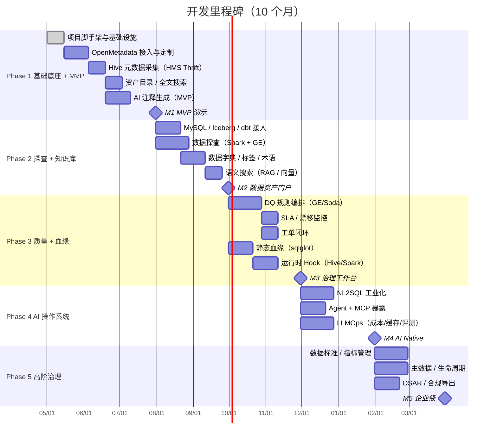

# 06 · 开发路线图与风险

**适用对象**：项目经理 / Tech Lead / 干系人  
**前置阅读**：[`00-总体规划-v2.md`](./00-总体规划-v2.md)

---

## 目录

1. [整体策略](#一整体策略)
2. [里程碑与 MVP](#二里程碑与-mvp)
3. [Phase 1-5 详细计划](#三phase-1-5-详细计划)
4. [团队与角色](#四团队与角色)
5. [风险清单与缓解](#五风险清单与缓解)
6. [验收标准](#六验收标准)

---

## 一、整体策略

| 策略 | 说明 |
|---|---|
| **3 个月见 MVP** | Hive 接入 → AI 注释 → 资产搜索三件套，3 个月内必须能演示 |
| **复用优于自研** | 元数据底座（OpenMetadata）、DQ 引擎（GE/Soda）、血缘协议（OpenLineage）、Prompt 平台（Langfuse）尽量直接拿来 |
| **AI 前置** | v1 的"AI 放最后"是错的，**Phase 1 即上注释 + 语义搜索**——这是最容易展示价值的功能 |
| **安全合规并行** | 不能等功能做完再补安全，分级分类 / 脱敏 / 审计在 Phase 1 就埋点 |
| **多租户从 Day 1** | 全部模型带 `tenant_id`，后期改造代价极大 |
| **每 4 周一个可演示版本** | 每个 Sprint 必须有可 demo 的产出 |

---

## 二、里程碑与 MVP

### MVP 定义（M1，3 个月）

> **能向高层 demo 的最小有价值产品**：

1. ✅ 接入一个真实 Hive 数据源（≥ 100 张表）
2. ✅ 资产目录 + 全文搜索（中英文）
3. ✅ **AI 自动生成字段注释**（高置信度直接展示，低置信度待审核）
4. ✅ 基础权限 + SSO + 审计
5. ✅ 部署到 staging K8s 集群

> 这 5 件事做到，就有了"卖相"，能争取后续投入。

---

## 三、Phase 1-5 详细计划

### Phase 1（M1-2）：基础底座 + MVP

#### 工作项

| 工作项 | 负责模块 | 工作量 |
|---|---|---|
| 项目脚手架（Mono / Multi repo 决策、CI/CD、镜像仓库） | DevOps | 1w |
| K8s 基础设施（Helm Chart 雏形、PostgreSQL/Redis/MinIO） | DevOps | 1w |
| 配置中心 + Vault 接入 | DevOps | 0.5w |
| Keycloak SSO + RBAC 雏形 | 后端 | 1w |
| 多租户基线（`tenant_id` + RLS） | 后端 | 1w |
| OpenMetadata 部署与定制（自定义 Custom Property） | 后端 | 2w |
| **Hive HMS Thrift Connector**（替代 PyHive） | 后端 | 2w |
| 元数据同步任务（Celery + 增量） | 后端 | 1.5w |
| 前端框架搭建（React 18 + AntD v5 + Pro Components） | 前端 | 1w |
| 资产目录页 + 全文搜索（OpenSearch） | 前端 + 后端 | 2w |
| **LLM Router + 私有 Ollama 接入** | AI | 1.5w |
| **AI 字段注释生成（Prompt v1）** | AI | 2w |
| 敏感扫描网关（基础规则） | 安全 | 1w |
| 审计日志埋点 | 后端 | 0.5w |
| Langfuse 部署 | DevOps | 0.5w |
| Demo 准备 + Bug 修复 | All | 1w |

#### 验收

- [ ] 100+ 张 Hive 表完成元数据同步
- [ ] 至少 80% 字段有 AI 生成的注释（置信度可见）
- [ ] 资产搜索 P95 延迟 < 500ms
- [ ] LLM 调用全部走私有部署，无外网调用
- [ ] SSO 登录 + 操作审计可见

### Phase 2（M3-4）：探查 + 知识库

| 工作项 | 工作量 |
|---|---|
| MySQL Connector | 1w |
| Iceberg Connector（REST Catalog） | 1.5w |
| dbt manifest Connector + 自动同步 description | 1w |
| 调度元数据 Connector（DolphinScheduler / Airflow 任选其一） | 1w |
| 数据探查引擎（Spark + GE 集成、采样分层） | 3w |
| 探查任务调度 + 结果可视化 | 2w |
| 数据字典编辑（人工 + AI 辅助） | 2w |
| 标签体系 + 业务术语表 | 1.5w |
| 向量库（Milvus）+ Embedding pipeline | 1.5w |
| **语义搜索 / RAG**（多向量 + 混合检索 + Reranker） | 2w |
| Schema 版本对比与变更通知 | 1w |
| PII 自动识别（规则 + 正则 + AI 三路打分） | 2w |
| 静态脱敏（探查样本入库前） | 1w |

#### 验收

- [ ] 4 类数据源（Hive/MySQL/Iceberg/dbt）+ 1 个调度系统接入
- [ ] 探查覆盖 P0/P1 表（手工标注），结果可见
- [ ] 语义搜索"上周北京 GMV 哪张表"能召回正确的表
- [ ] PII 字段自动识别准确率 ≥ 90%

### Phase 3（M5-6）：质量 + 血缘

| 工作项 | 工作量 |
|---|---|
| Great Expectations + Soda Core 编排层 | 2w |
| 7 维度规则配置 UI | 2.5w |
| 规则执行调度（Temporal） | 1.5w |
| 质量结果库 + 看板 | 1.5w |
| **SLA / 时效性监控**（任务级 + 分区就绪） | 2w |
| 漂移检测（PSI / KS） | 1.5w |
| **工单闭环工作流**（Owner / 审批 / 整改 / 关闭） | 2w |
| sqlglot 静态血缘 | 2w |
| Hive Hook + Spark QueryExecutionListener | 3w |
| OpenLineage 事件总线 + 血缘合并器 | 2w |
| 三级血缘（任务/表/字段）UI（AntV G6） | 2w |
| 影响分析功能 | 1w |

#### 验收

- [ ] 50+ 条质量规则上线，覆盖 P0 表
- [ ] SLA 监控发现真实生产事故
- [ ] 表级血缘覆盖率 ≥ 85%（静态 + 运行时合并后）
- [ ] 字段级血缘覆盖率 ≥ 60%
- [ ] 工单闭环：从发现 → 关闭平均 < 48 小时（P1）

### Phase 4（M7-8）：AI 操作系统

| 工作项 | 工作量 |
|---|---|
| **NL2SQL 工业化**（Schema Linking / Few-shot / Self-Correct / 安全护栏） | 4w |
| 指标层雏形（YAML 定义 + SQL 模板） | 2w |
| **MCP Server**（暴露平台能力） | 2w |
| 内置 Agent：DailyHealthAgent | 1.5w |
| 内置 Agent：DQRecommendAgent | 1.5w |
| 内置 Agent：RootCauseAgent | 1.5w |
| 内置 Agent：ImpactAgent | 1w |
| **LLMOps**：成本仪表盘 + 配额限流 | 2w |
| 语义缓存 + 评测中心 | 2w |
| Prompt Registry 灰度发布 | 1.5w |
| Cursor / IDE Copilot 接入 demo | 0.5w |

#### 验收

- [ ] NL2SQL Execution Accuracy ≥ 80%（内部测试集）
- [ ] LLM 月度成本可观测可控（每个租户）
- [ ] 至少 1 个 Agent 在生产稳定运行
- [ ] 平台能力可被 Cursor / Claude Desktop 通过 MCP 调用

### Phase 5（M9-10）：高阶治理 + 合规

| 工作项 | 工作量 |
|---|---|
| 数据标准管理（命名 / 码值 / 格式 / 单位） | 2.5w |
| 标准 ↔ 字段绑定 + AI 推荐 | 2w |
| 指标管理完整版（版本 / 审批 / 一致性校验） | 2.5w |
| 主数据精简版（实体注册 + 同义词归并） | 2w |
| 生命周期 + 成本归因 | 2w |
| **DSAR 数据足迹查询** | 2w |
| 合规导出 / 数据出境清单 | 1.5w |
| 数据访问申请审批流 | 2w |
| 动态脱敏（Ranger 集成 / 自研代理） | 2w |
| 安全测试 + 等保整改 | 2w |

#### 验收

- [ ] 数据标准覆盖核心域，违规告警生效
- [ ] 至少一个核心指标走指标层（NL2SQL 命中）
- [ ] DSAR 请求 → 数据足迹报告 < 4 小时
- [ ] 等保 / SOC2 预审通过

---

## 四、团队与角色

### 4.1 团队配置（建议）

| 角色 | 人数 | 职责 |
|---|---|---|
| Tech Lead | 1 | 整体架构、关键决策 |
| 后端工程师 | 4-5 | API / 元数据 / 质量 / 血缘 |
| AI 工程师 | 2 | LLM 抽象 / NL2SQL / Agent / RAG |
| 前端工程师 | 2 | Web UI / 可视化 |
| 数据工程师 | 1-2 | Connector / 探查 / DQ 集成 |
| DevOps / SRE | 1 | K8s / 监控 / CI/CD |
| 数据治理顾问 | 0.5 | 治理标准 / 业务对接（兼） |
| 安全合规 | 0.5 | 安全评审（兼） |
| 产品经理 | 1 | 需求 / 验收 |
| 设计 | 0.5 | UI/UX（兼） |

> 总人数约 12-14 人，10 个月。

### 4.2 协作机制

- 每 2 周一个 Sprint，Sprint 末做内部 demo
- 每月一次架构 Review（ADR 评审）
- 每月一次安全合规 Review
- 每季度做一次外部干系人 Demo

---

## 五、风险清单与缓解

| ID | 风险 | 等级 | 影响 | 缓解 |
|---|---|---|---|---|
| R-01 | LLM 把生产数据/SQL 泄漏到外网 | **高** | 法律 / 公关 | 默认私有部署 + 敏感扫描网关 + 审计 |
| R-02 | 血缘准确率不达预期 | **高** | 用户信任崩溃 | 提前预期 80%，双轨制 + 人工纠错 + 标注 confidence |
| R-03 | OpenMetadata 二次开发陷入维护 | 中 | 进度 / 成本 | 升级路径设计、不动核心 Schema、Custom Property 优先 |
| R-04 | Hive Metastore 版本兼容 | 中 | 接入失败 | 优先 Thrift（多版本兼容），不行回退 metastore_db 直读 |
| R-05 | Kerberos 在开发环境配置困难 | 中 | 开发效率低 | 远程 Devbox + Mock Connector |
| R-06 | 大表探查性能 / 对集群压力 | **高** | 生产事故 | 分层采样、独立资源队列、限流、错峰 |
| R-07 | 多租户后期返工 | 中 | 重大重构 | Day-1 即落 `tenant_id` + RLS |
| R-08 | NL2SQL 错误 SQL 误执行 | **高** | 生产事故 | 只读账号 + 安全护栏 + 强制 LIMIT + EXPLAIN |
| R-09 | LLM 成本失控 | 中 | 预算超支 | 私有部署 + 缓存 + 配额 + 月度审计 |
| R-10 | 团队 AI 工程化经验不足 | 中 | 质量风险 | 提前培训、引入 LLMOps 顾问、外采评测集 |
| R-11 | 与现有调度系统集成边界不清 | 中 | 责任纠纷 | 明确"我们不做调度"，仅消费元数据 / 血缘事件 |
| R-12 | 监管要求变化（个保法细则）| 中 | 合规返工 | 安全合规模块抽象，配置化策略 |
| R-13 | 内部数据治理标准不统一 | 中 | 业务方拒收 | 提前 30 天与各部门 Owner 对齐 |
| R-14 | OpenSearch / Milvus 运维复杂 | 低 | 稳定性 | 用 Operator + 早期数据量小，逐步扩容 |
| R-15 | LLM Provider 不稳定 / 涨价 | 中 | 业务中断 | Fallback + 自部署兜底 + 协议层抽象 |
| R-16 | 数据资产 Owner 缺位 | **高** | 治理形同虚设 | 推动组织层面 Owner 责任制（与 KPI 挂钩） |
| R-17 | "AI 注释"误导业务 | 中 | 决策错误 | 标注"AI 生成 / 待人工审核"，置信度可见，关键字段强制人工 |
| R-18 | 路线图过于激进 | 中 | 进度延期 | 每 4 周复盘，关键里程碑保留 20% buffer |
| R-19 | 成本治理数据不全 | 中 | ROI 评估失败 | Phase 5 落地前先打通存储 / 计算两条数据线 |
| R-20 | 历史血缘补录困难 | 中 | 影响分析不全 | 接受现状，仅做 D-1 之后的血缘 |

---

## 六、验收标准

### 6.1 功能验收

参见各 Phase "验收"小节。

### 6.2 非功能验收

| 维度 | 指标 |
|---|---|
| **性能** | 资产搜索 P95 < 500ms、首页 P95 < 1s、NL2SQL P95 < 8s |
| **可用性** | 核心服务 SLA ≥ 99.9% |
| **可扩展性** | 单集群支撑 10 万张表元数据 |
| **安全** | 通过等保 2.0 三级 / 内部安全红蓝对抗 |
| **合规** | 通过法务 / 安全合规评审 |
| **可观测** | 关键指标全覆盖、告警有 Runbook |
| **文档** | 架构文档 / API 文档 / 运行手册齐全 |
| **测试** | 单元覆盖率 ≥ 70%、E2E 覆盖核心路径 |

### 6.3 用户成功指标（上线 6 个月内）

| 指标 | 目标 |
|---|---|
| 月活用户 | ≥ 团队人数 × 2（数据 + 业务部门）|
| 资产覆盖率 | 关键域 ≥ 80% |
| 自动化注释采纳率 | ≥ 60% |
| 数据健康分提升 | 季度 +10 |
| 治理工单关闭率 | P1 ≥ 80% |
| NL2SQL 周活查询 | ≥ 100 次 |

---

## 七、立项后的第一周

> 拿到 v2 方案立项通过后，强烈建议立刻做以下事情：

1. **建立 ADR 仓**：`doc/Architecture/adr/`，把第 [00 文档](./00-总体规划-v2.md#32-关键架构决策adr-摘要) 的 10 个决策每个写成独立 ADR。
2. **拉齐数据团队 + 业务团队**：列出 P0/P1 数据源清单、关键 Owner、痛点排序。
3. **采购 / 申请资源**：K8s 集群 / GPU 节点池 / 模型 / SSO 系统 / 监控基础设施。
4. **挑选 1-2 个"试点业务域"**：拒绝"全量上线"，先在一个业务域跑通闭环。
5. **建立反馈机制**：每周 1 次治理用户访谈，记录痛点。

---

> 上一篇：[`05-部署与运维.md`](./05-部署与运维.md)  
> 回到：[总体规划-v2](./00-总体规划-v2.md) / [README](./README.md)
